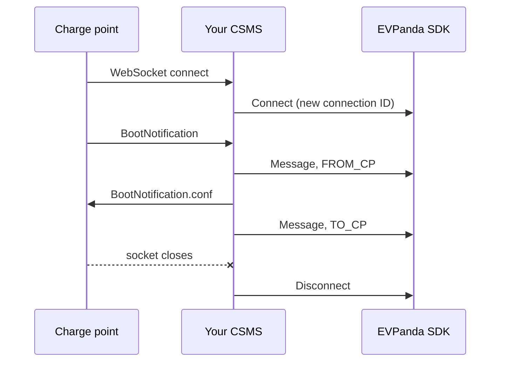
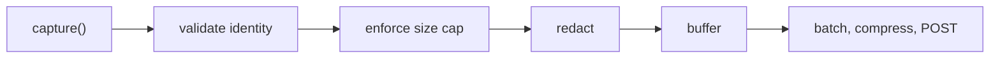

The SDK records two things: OCPP events on a WebSocket connection, and OCPI HTTP exchanges with a roaming partner.

## OCPP events

Three event types, all carrying the same charger identity and connection ID.

| Event | Recorded when | Carries a frame |
| --- | --- | --- |
| Connect | The WebSocket is established | No |
| Message | A frame crosses the socket, either direction | Yes |
| Disconnect | The socket closes, for any reason | No |

### Connection ID

Every OCPP event carries a connection ID. The SDK mints it, it is stable for the life of one WebSocket, and it is fresh on every reconnect. That is what turns a stream of frames into a session you can read top to bottom, and what lets the dashboard show a charger that flapped twenty times in an hour instead of one endless session.



The session handle from `connection()` mints and carries the ID for you, so per frame calls do not pass one.

### Direction

Direction is from the charge point's perspective.

| Value | Meaning |
| --- | --- |
| `FROM_CP` | The charge point sent it to you: `BootNotification`, `Heartbeat`, `StatusNotification`, and results answering your calls |
| `TO_CP` | You sent it to the charge point: `RemoteStartTransaction`, `Reset`, and results answering its calls |

Record the direction at the actual socket read or write. A helper both sides call is where directions get flipped, and flipped directions make every request look like a response.

### Frames are verbatim

Frames are captured as raw bytes, exactly as they crossed the wire. Nothing is reformatted or stripped.

There is no OCPP redaction. If a payload carries data you do not want stored, `idTag` for example, mask it before you hand the frame to the SDK.

## OCPI exchanges

One complete HTTP request and response pair, plus its direction.

| Field | Required | Notes |
| --- | --- | --- |
| `method` | Yes | `GET`, `POST`, `PUT`, `PATCH`, or `DELETE` |
| `url` | Yes | The URL as your service saw it |
| `statusCode` | See below | |
| `requestHeaders` | No | Filtered by the [header allowlist](#the-ocpi-header-allowlist) |
| `responseHeaders` | No | Same filtering |
| `requestBody` | No | Raw bytes |
| `responseBody` | No | Raw bytes |

<Warning>
  The SDKs let you omit the status code, but the ingestion API requires a value between 100 and 599 and rejects the message without one, after a successful delivery. Always set it. For an exchange that never produced a response, skip the capture.
</Warning>

Direction is set by the method you call, so there is no argument to get backwards.

| Method | Direction | You are the | Typical case |
| --- | --- | --- | --- |
| `captureInboundMessage` | `IN` | server | A partner pushes a CDR to your endpoint |
| `captureOutboundMessage` | `OUT` | client | You pull a partner's locations |

## Redaction runs before buffering

Redaction happens at the capture chokepoint, the last point before the message enters memory that outlives the call. Nothing unredacted is ever buffered, so nothing unredacted can be delivered, logged, or recovered from a crash dump.



### The OCPI header allowlist

OCPI headers are filtered by an allowlist, not a denylist. Only these are kept. Everything else, including `Authorization`, `Cookie`, and `X-API-Key`, is dropped at capture.

| Category | Headers |
| --- | --- |
| OCPI routing | `OCPI-from-country-code`, `OCPI-from-party-id`, `OCPI-to-country-code`, `OCPI-to-party-id` |
| Content | `Content-Type`, `Accept`, `User-Agent` |
| Tracing | `X-Correlation-Id`, `X-Request-Id` |
| Pagination | `X-Total-Count`, `X-Limit`, `Link` |

Matching is case insensitive. `ocpiAllowedHeaders` extends the list and can never shrink it, so you cannot configure your way into leaking `Authorization`.

<CodeGroup>
```go Go
evpanda.StartOCPI(evpanda.OCPIConfig{
    OCPIAllowedHeaders: []string{"x-trace-id"},
})
```

```ts Node
startOCPI({ ocpiAllowedHeaders: ["x-trace-id"] });
```

```python Python
evpanda.start_ocpi(evpanda.OCPIConfig(ocpi_allowed_headers=["x-trace-id"]))
```
</CodeGroup>

Only add headers you know carry no secret. An allowlisted header is stored and displayed exactly as it arrived.

### Credentials tokens are masked

The OCPI `/credentials` module exchanges the tokens partners authenticate with. Those exchanges are worth capturing, since registration failures are a common roaming problem, but the tokens are not.

On any URL ending in `/credentials`, the `token` field is replaced with `[redacted]`, both at the root of a request body and under `data` in a response envelope.

```json
{
  "url": "/ocpi/2.2/credentials",
  "response_body": {
    "data": {
      "token": "[redacted]",
      "url": "https://partner.example/ocpi/versions",
      "roles": [{ "role": "CPO", "party_id": "ACM", "country_code": "NL" }]
    },
    "status_code": 1000
  }
}
```

If the body is not JSON, or has no `token` at either location, it is captured unchanged. Masking never drops data it could not safely rewrite.

## Limits

| Limit | Default | When exceeded |
| --- | --- | --- |
| Per body or frame | 64 KiB | The whole message is dropped, never truncated |
| Buffer ceiling | 32 MiB | Oldest buffered captures are evicted |
| Compressed batch | 5 MB | Rejected by the ingestion API |
| Decompressed batch | 20 MB | Rejected by the ingestion API |

Dropping rather than truncating is deliberate. A body cut in half validates as broken and would generate issues describing the SDK rather than your traffic.

## What is never captured

| | |
| --- | --- |
| Anything you do not hand it | Capture is explicit. No globals are patched, no sockets hooked. A frame you never pass does not exist to EVPanda, which is also how you exclude traffic on purpose. |
| Headers outside the allowlist | Dropped at capture, before the buffer. |
| Bodies over the cap | The whole message goes. |
| Transport level events | TLS handshakes, WebSocket ping and pong, TCP resets, and retries inside your own HTTP client are not protocol messages. |
| Failed outbound calls | A call that fails at the transport layer, DNS or connection refused or timeout, has no exchange to record. A response you never read is never shipped either. |

## Transport

Batches are posted over HTTPS to `ingest.evpanda.io`. The API key travels in the `X-API-Key` header, never in a URL. Bodies above roughly 1 KB are compressed with zstd.

The SDK only ever opens connections outward. EVPanda never connects to you, there is no control channel, and no remote configuration. Behind an egress firewall, `ingest.evpanda.io` on port 443 is the only destination needed.

## Timestamps

The SDK stamps the capture time in your process, using the host clock. EVPanda normalizes it to UTC at millisecond precision on arrival.

Ordering in the dashboard therefore follows your clock, which is what you want when correlating with your own logs, and a reason to keep NTP healthy.

## Retention

Captured messages are kept for 90 days by default, then deleted. Issues and discovered entities, chargers and platforms and tenants, persist beyond the raw messages they came from.

Contact [support@evpanda.io](mailto:support@evpanda.io) for a different window.

<Tip>
  Decide what you are allowed to send before production. OCPI bodies can contain CDRs and tokens; OCPP frames can contain RFID identifiers. Review a real captured message in staging with whoever owns privacy at your company.
</Tip>
