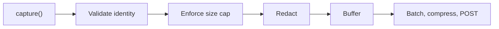

The SDK records two things, one per protocol: **OCPP events** on a WebSocket connection, and **OCPI HTTP exchanges** with a roaming partner. Everything the dashboard shows is derived from these two records.

## OCPP events

An OCPP capture is one of three event types, all carrying the same charger identity and connection ID.

| Event | When you record it | Carries a frame? |
| --- | --- | --- |
| **Connect** | A charge point's WebSocket is established | No |
| **Message** | Any frame crosses the socket, in either direction | Yes |
| **Disconnect** | The socket closes, for any reason | No |

### Connections tie the events together

Every OCPP event carries a **connection ID**: an SDK-minted identifier that is stable for the lifetime of one WebSocket and fresh on every reconnect. It is what turns a stream of frames into a session you can read top to bottom.


A charger that reconnects gets a new connection ID, which is exactly what you want: the dashboard can then show that a charge point flapped twenty times in an hour, instead of one endless session.

### Direction is from the charge point's perspective

| Value | Meaning |
| --- | --- |
| `FROM_CP` | The charge point sent it to you (`BootNotification`, `StatusNotification`, `Heartbeat`, a `CALLRESULT` to your request) |
| `TO_CP` | You sent it to the charge point (`RemoteStartTransaction`, a `CALLRESULT` to their request) |

Getting these backwards makes every request look like a response, so the validation engine flags traffic that makes no sense. Record the direction at the point of the actual socket read or write.

### Frames are stored verbatim

Frames are captured as raw bytes, exactly as they crossed the wire. Nothing is reformatted, reordered, or stripped, so what you see in the dashboard is what your charge point actually sent.

<Note>
  There is no OCPP redaction. If your payloads carry data you don't want stored — an `idTag` you consider personal, for example — mask it before you hand the frame to the SDK.
</Note>

## OCPI exchanges

An OCPI capture is one complete HTTP request/response pair, plus its direction.

| Field | Required | Notes |
| --- | --- | --- |
| `method` | Yes | `GET`, `POST`, `PUT`, `PATCH`, or `DELETE` |
| `url` | Yes | The URL as your service saw it |
| `statusCode` | Optional to the SDK | But required downstream — see below |
| `requestHeaders` | Optional | Filtered by the [header allowlist](#ocpi-the-header-allowlist) |
| `responseHeaders` | Optional | Same filtering |
| `requestBody` | Optional | Raw bytes |
| `responseBody` | Optional | Raw bytes |

<Warning>
  The SDKs let you omit `statusCode`, but the ingestion API requires a value between 100 and 599 and rejects the message without one — after a successful delivery, so nothing in the SDK reports the loss. Record the status your service actually returned, or skip the capture entirely for an exchange that never produced a response.
</Warning>

### Direction is from your perspective

OCPI is symmetric — you are a server to your partners and a client to them — so each exchange records which side you were on. There is no direction argument to get wrong: the method you call sets it.

| You call | Direction | You are the… | Typical case |
| --- | --- | --- | --- |
| `captureInboundMessage` | `IN` | server | A partner pushes a CDR to your endpoint |
| `captureOutboundMessage` | `OUT` | client | You pull a partner's locations |

## Redaction happens before buffering

Redaction runs at the capture chokepoint — the last moment before a message enters memory that outlives the call. Nothing unredacted is ever buffered, so nothing unredacted can be delivered, logged, or recovered from a crash dump.



### OCPI: the header allowlist

OCPI headers are filtered by an **allowlist**, not a denylist. Only the headers below are captured; everything else — including `Authorization`, `Cookie`, and `X-API-Key` — is dropped at capture and never reaches the buffer.

| Category | Headers kept by default |
| --- | --- |
| OCPI routing | `OCPI-from-country-code`, `OCPI-from-party-id`, `OCPI-to-country-code`, `OCPI-to-party-id` |
| Content negotiation | `Content-Type`, `Accept`, `User-Agent` |
| Tracing | `X-Correlation-Id`, `X-Request-Id` |
| Pagination | `X-Total-Count`, `X-Limit`, `Link` |

Matching is case-insensitive. The list can be **extended** through `ocpiAllowedHeaders`, never shrunk — the defaults are always kept, so you cannot configure your way into leaking `Authorization`. See [OCPI server](/integration/ocpi#capture-extra-headers).

<Warning>
  Only add headers you are certain carry no secret. An allowlisted header is stored and displayed in the dashboard exactly as it arrived.
</Warning>

### OCPI: credentials tokens are masked

The OCPI `/credentials` module exchanges the tokens partners use to authenticate against each other. Those exchanges are worth capturing — registration failures are a classic roaming problem — but the tokens themselves are not.

On any URL ending in `/credentials`, the SDK replaces the `token` field with `[redacted]`, in both the request body and the `data` object of the response envelope:

```json Captured
{
  "url": "/ocpi/2.2/credentials",
  "response_body": {
    "data": {
      "token": "[redacted]",
      "url": "https://partner.example/ocpi/versions",
      "roles": [{ "role": "CPO", "party_id": "ACM", "country_code": "NL" }]
    },
    "status_code": 1000
  }
}
```

If the body isn't JSON, or has no `token` at either known location, it is captured unchanged — masking never silently drops data it couldn't safely rewrite.

## Size limits

| Limit | Default | Effect when exceeded |
| --- | --- | --- |
| Per body or frame | 64 KiB | The **whole message** is dropped — never truncated |
| Buffer ceiling | 32 MiB (Go) / 10,000 messages (Node, Python) | Oldest buffered captures are evicted |
| Compressed batch | 5 MB | Rejected by the ingestion API |
| Decompressed batch | 20 MB | Rejected by the ingestion API |

Dropping rather than truncating is deliberate: a body cut in half validates as broken and would generate issues that describe the SDK, not your traffic. Raise the per-capture cap if you routinely exchange large OCPI location or CDR payloads.

## What the SDK does not capture

<AccordionGroup>
  <Accordion title="Anything you don't hand it" icon="hand">
    Capture is explicit. The SDK patches no globals, hooks no sockets, and monkey-patches nothing. A frame you never pass to it does not exist as far as EVPanda is concerned — which is also how you exclude traffic on purpose.
  </Accordion>

  <Accordion title="Headers outside the OCPI allowlist" icon="shield">
    `Authorization`, `Cookie`, `X-API-Key`, and every other unlisted header are dropped at capture, before the message reaches the buffer.
  </Accordion>

  <Accordion title="Bodies over the size cap" icon="ruler">
    A body or frame larger than the per-capture cap drops the whole message rather than storing a truncated one.
  </Accordion>

  <Accordion title="Transport-level events" icon="cable">
    TLS handshakes, WebSocket ping/pong frames, TCP resets, and HTTP retries inside your own client are not protocol messages, and the SDK has no visibility into them. What it sees is what your application layer sees.
  </Accordion>

  <Accordion title="Requests that never completed" icon="unplug">
    An outbound OCPI call that fails at the transport layer — DNS failure, connection refused, timeout — has no exchange to record. A response you receive and then never read is also never shipped, since the adapters complete capture when the body is closed.
  </Accordion>
</AccordionGroup>

## Transport

<Columns cols={2}>
  <Card title="Encrypted in transit" icon="lock" horizontal>
    Batches are POSTed over HTTPS to `ingest.evpanda.io`. The API key travels in the `X-API-Key` header and is never placed in a URL.
  </Card>

  <Card title="Compressed by default" icon="package" horizontal>
    Bodies are compressed with zstd, or gzip if you prefer. Payloads below about 1 KB are sent uncompressed.
  </Card>

  <Card title="Outbound only" icon="arrow-up-from-line" horizontal>
    The SDK opens connections to EVPanda; EVPanda never connects to you. No control channel, no remote configuration, no callback into your process.
  </Card>

  <Card title="Egress allowlisting" icon="network" horizontal>
    Behind an egress firewall, `ingest.evpanda.io` on port 443 is the only destination the SDK needs.
  </Card>
</Columns>

## Timestamps

The SDK stamps the capture time in your process, using the host clock. EVPanda normalizes it to UTC with millisecond precision on arrival.

Message ordering in the dashboard therefore follows **your** clock, not the ingestion server's — which is what you want when correlating with your own logs, and a reason to keep NTP healthy on the hosts running your CSMS.

## Retention

Captured messages are retained for **90 days** by default, then deleted. Issues and the entities discovered from your traffic — chargers, platforms, tenants — persist beyond the raw messages they were derived from.

If your policy needs a different window, contact [support@evpanda.io](mailto:support@evpanda.io).

<Tip>
  Decide what you are allowed to send before you go to production. OCPI bodies can contain CDRs and tokens; OCPP frames can contain RFID identifiers. Both may be personal data under your jurisdiction. Review a real captured message in staging with whoever owns privacy at your company before you point the SDK at production traffic.
</Tip>
