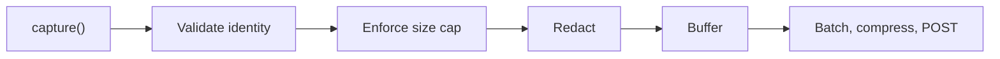

The SDK ships protocol traffic to EVPanda, which means it ships payloads your partners and chargers sent you. This page is the complete account of what goes, what doesn't, and what you control.

## Redaction happens before buffering

Redaction runs at the capture chokepoint — the last moment before a message enters memory that outlives the call. Nothing unredacted is ever buffered, so nothing unredacted can be delivered, logged, or recovered from a crash dump.



## OCPI: the header allowlist

OCPI headers are filtered by an **allowlist**, not a denylist. Only the headers below are captured; everything else — including `Authorization`, `Cookie`, and `X-API-Key` — is dropped at capture and never reaches the buffer.

| Category | Headers kept by default |
| --- | --- |
| OCPI routing | `OCPI-from-country-code`, `OCPI-from-party-id`, `OCPI-to-country-code`, `OCPI-to-party-id` |
| Content negotiation | `Content-Type`, `Accept`, `User-Agent` |
| Tracing | `X-Correlation-Id`, `X-Request-Id` |
| Pagination | `X-Total-Count`, `X-Limit`, `Link` |

Matching is case-insensitive.

### Extending the allowlist

If you need a header that isn't listed — your own trace header, a partner's routing header — add it in config. The list can only be **extended**, never shrunk: the defaults are always kept, so you cannot accidentally configure your way into leaking `Authorization`.

<CodeGroup>
  ```go Go
  evpanda.StartOCPI(evpanda.OCPIConfig{
      BaseConfig:         evpanda.BaseConfig{Endpoint: endpoint},
      OCPIAllowedHeaders: []string{"x-trace-id", "x-tenant-hint"},
  })
  ```

  ```ts Node
  OCPIClient.start({
    endpoint,
    ocpiAllowedHeaders: ["x-trace-id", "x-tenant-hint"],
  });
  ```

  ```python Python
  OCPIClient.start(
      OCPIConfig(
          endpoint=endpoint,
          ocpi_allowed_headers=["x-trace-id", "x-tenant-hint"],
      )
  )
  ```
</CodeGroup>

<Warning>
  Only add headers you are certain carry no secret. A header you allowlist is stored and displayed in the dashboard exactly as it arrived.
</Warning>

## OCPI: credentials tokens are masked

The OCPI `/credentials` module exchanges the tokens partners use to authenticate against each other. Those exchanges are worth capturing — registration failures are a classic roaming problem — but the tokens themselves are not.

On any URL ending in `/credentials`, the SDK replaces the `token` field with `[redacted]`, in both the request body and the `data` object of the response envelope:

```json Captured
{
  "url": "/ocpi/2.2/credentials",
  "response_body": {
    "data": {
      "token": "[redacted]",
      "url": "https://partner.example/ocpi/versions",
      "roles": [{ "role": "CPO", "party_id": "ACM", "country_code": "NL" }]
    },
    "status_code": 1000
  }
}
```

If the body isn't JSON, or has no `token` at either known location, the body is captured unchanged — masking never silently drops data it couldn't safely rewrite.

## OCPP: frames are captured verbatim

There is no OCPP redaction. Frames go to EVPanda exactly as they crossed the wire, because an altered frame is not evidence of what your charger did.

That is the right default for protocol debugging, but it means **you** decide what OCPP payloads are allowed to leave your process. If a field is sensitive under your privacy policy — `idTag` in `Authorize` and `StartTransaction` is the usual candidate — mask it before you hand the frame to the SDK:

<CodeGroup>
  ```go Go
  sess.Message(maskIDTag(frame), evpanda.FromCP)
  ```

  ```ts Node
  session.message(maskIdTag(frame), "FROM_CP");
  ```

  ```python Python
  session.message(mask_id_tag(frame), OCPPDirection.FROM_CP)
  ```
</CodeGroup>

## Size limits

| Limit | Default | Effect when exceeded |
| --- | --- | --- |
| Per body or frame | 64 KiB | The **whole message** is dropped — never truncated |
| Buffer ceiling | 32 MiB (Go) / 10,000 messages (Node, Python) | Oldest buffered captures are evicted |
| Compressed batch | 5 MB | Rejected by the ingestion API with `413` |
| Decompressed batch | 20 MB | Rejected by the ingestion API with `413` |

Dropping rather than truncating is deliberate: a body cut in half validates as broken and would generate issues that describe the SDK, not your traffic. Raise `maxCaptureBytes` if you routinely exchange large OCPI location or CDR payloads. See [Configuration](/operate/configuration).

## Transport

<Columns cols={2}>
  <Card title="Encrypted in transit" icon="lock" horizontal>
    Batches are POSTed over HTTPS to `ingest.evpanda.io`. The API key travels in the `X-API-Key` header and is never placed in a URL.
  </Card>

  <Card title="Compressed by default" icon="package" horizontal>
    Bodies are compressed with zstd, or gzip if you prefer. Payloads below about 1 KB are sent uncompressed, where compression would cost more than it saves.
  </Card>

  <Card title="Outbound only" icon="arrow-up-from-line" horizontal>
    The SDK opens connections to EVPanda; EVPanda never connects to you. There is no control channel, no remote configuration, and no callback into your process.
  </Card>

  <Card title="Egress allowlisting" icon="network" horizontal>
    If your CSMS runs behind an egress firewall, `ingest.evpanda.io` on port 443 is the only destination the SDK needs.
  </Card>
</Columns>

## Retention

Captured messages are retained for **90 days** by default, then deleted. Issues and the entities discovered from your traffic — chargers, platforms, tenants — persist beyond the raw messages they were derived from.

If your policy needs a different window, contact [support@evpanda.io](mailto:support@evpanda.io).

## Practical guidance

<AccordionGroup>
  <Accordion title="Decide what you're allowed to send before you go to production" icon="clipboard-check">
    OCPI bodies can contain CDRs and tokens; OCPP frames can contain RFID identifiers. Both may be personal data under your jurisdiction. Review a real captured message in staging with whoever owns privacy at your company before you point the SDK at production.
  </Accordion>

  <Accordion title="Use separate networks and keys per environment" icon="split">
    A staging key that leaks is a much smaller problem than a production one, and separate networks keep test traffic out of your real issue counts.
  </Accordion>

  <Accordion title="Rotate keys on a schedule" icon="rotate-cw">
    Generate the new key, deploy, confirm traffic is still arriving, then revoke the old one. Revocation is immediate; a revoked key fails with `401`, which the SDK treats as permanent and does not retry.
  </Accordion>

  <Accordion title="Turn the SDK silent, not off, during an incident" icon="volume-x">
    If SDK logging becomes noise in the middle of an outage, set `EVPANDA_LOG=silent` (Go) or disable `debug` (Node, Python) and restart. Capture keeps working and counters keep counting — you just stop hearing about it.
  </Accordion>
</AccordionGroup>
