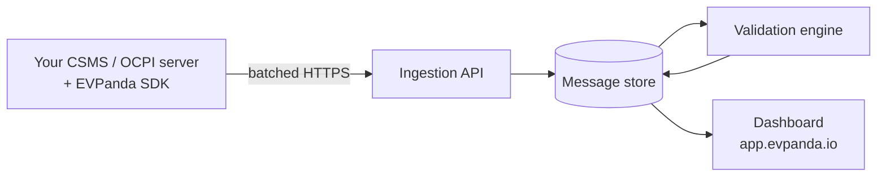

EVPanda has four moving parts: an SDK inside your service, an ingestion API, a validation engine, and the dashboard. Traffic flows one way through them.

## 1. The SDK captures

The SDK lives in your process. You call it where you already handle protocol traffic — a WebSocket read loop for OCPP, an HTTP handler or client for OCPI — and it records what passed through.

Capture is deliberately cheap:

| Step | What happens |
| --- | --- |
| Validate | The message's identity is checked. One that can't be attributed is dropped rather than shipped as an orphan. |
| Cap | Bodies and frames over `maxCaptureBytes` (64 KiB by default) drop the whole message rather than storing a truncated one. |
| Redact | OCPI headers pass through an allowlist; `/credentials` tokens are masked. This is the last point before the data outlives the call. |
| Buffer | The message goes into an in-memory ring buffer, and the call returns. |

Everything after that happens on a background worker. Your request path never waits on EVPanda.

<Note>
  Capture is passive. The SDK is not a proxy and not middleware in the protocol sense — it never rewrites a frame, alters a response, delays a handler, or fails a request because EVPanda is unreachable.
</Note>

## 2. The SDK delivers

One background worker per client owns delivery. It flushes when a full batch of 1,000 messages is waiting or when the flush interval elapses, whichever comes first, then compresses the batch (zstd by default) and POSTs it to the ingestion API.

Failed deliveries retry with capped exponential backoff. If the upstream stays down, the buffer fills, and the SDK evicts its own oldest captures once it hits the memory ceiling you configured. Your service is never slowed down and never grows unbounded on EVPanda's account.

See [How delivery works](/operate/delivery) for the full pipeline, including batch sizes, retry policy, and drain behavior.

## 3. The ingestion API accepts

The ingestion API authenticates the batch with your network's API key, validates each message independently, and writes valid ones to durable storage before returning. It never blocks and never asks your SDK to retry a batch that will always fail:

- Valid messages are persisted and counted as `captured`.
- Invalid messages are dropped and counted as `failed`.
- A batch where every message fails still returns `200` — a permanently bad batch must not trigger a retry storm against your production path.

The response is a two-number summary, not a per-message report. The SDK's own counters and the dashboard are how you find out what didn't make it.

See the [Ingestion API reference](/reference/ingestion-api) for the wire contract.

## 4. The validation engine analyzes

Once a message is stored, the validation engine picks it up and runs it through protocol-aware checks built for OCPP 1.6 and OCPI 2.2.1. It goes well past JSON schema:

- **Structural checks** — malformed envelopes, wrong frame shapes, missing required fields.
- **Cross-field checks** — values that are individually legal but contradict each other inside one message.
- **Cross-message checks** — calls that never got a result, replies that don't match a request, sequences that never complete.
- **Anomaly checks** — behavior that violates no rule but signals a broken charger or partner.

Findings become **issues**, grouped by type so a fault that repeats ten thousand times is one row with a count, not ten thousand rows. See [Issues and validation](/concepts/issues).

## 5. The dashboard shows

The dashboard at [app.evpanda.io](https://app.evpanda.io) is where your team works:

<Columns cols={2}>
  <Card title="Messages" icon="list" horizontal>
    Every captured message, filterable by charger, platform, tenant, action, direction, and status. Open one to see the full decoded request and response.
  </Card>

  <Card title="Issues" icon="triangle-alert" horizontal>
    Grouped findings with occurrence trends, affected chargers or partners, and a link into the exact messages that triggered them.
  </Card>

  <Card title="Chargers and platforms" icon="plug" horizontal>
    Discovered automatically from your traffic. Online state, connectors, firmware, last-seen, and the most recent reported configuration.
  </Card>

  <Card title="Search" icon="search" horizontal>
    One search box across networks — charger IDs, partner names, tenants, and message tags such as session or location IDs.
  </Card>
</Columns>

## What this means for your service

<AccordionGroup>
  <Accordion title="How much latency does capture add?" icon="timer">
    A capture is a validation, a size check, a copy, and a buffer write — microseconds, and no I/O. There is no network call on your thread, so an unreachable EVPanda costs your service nothing.
  </Accordion>

  <Accordion title="How much memory does it use?" icon="database">
    Whatever ceiling you set. The Go SDK caps the buffer by bytes and defaults to 32 MiB; the Node and Python SDKs cap it by message count and default to 10,000 slots. The buffer grows on demand and sits far below the ceiling when delivery is healthy.
  </Accordion>

  <Accordion title="How fresh is the data?" icon="clock">
    Near real time. A message is delivered within one flush interval — five seconds by default — plus validation time. Lower `flushInterval` for tighter feedback while debugging, at the cost of more requests.
  </Accordion>

  <Accordion title="What happens if EVPanda is down?" icon="cloud-off">
    Your service keeps running exactly as it did. The SDK buffers, retries, and eventually drops its own oldest captures. When the API recovers, delivery resumes on the next flush. Nothing in your protocol handling changes.
  </Accordion>
</AccordionGroup>
