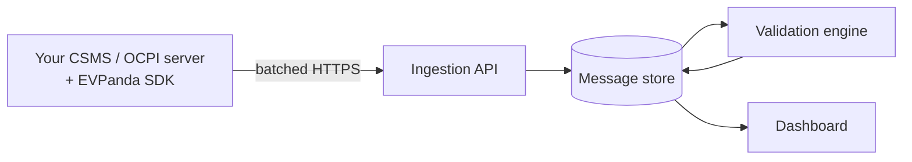

EVPanda records the protocol traffic your systems already exchange, validates it, and gives your team one place to search it.

You embed an SDK in your OCPP CSMS or OCPI server. It captures messages, buffers them in memory, and ships them in batches to the EVPanda ingestion API. Capture is passive: it never rewrites a frame, delays a handler, or fails a request.

<Columns cols={2}>
  <Card title="Get started" icon="rocket" href="/integration/getting-started" horizontal>
    Install an SDK and send your first message.
  </Card>

  <Card title="Core concepts" icon="shapes" href="/concepts/networks" horizontal>
    Networks, identity, and what gets captured.
  </Card>
</Columns>

## What you get

| | |
| --- | --- |
| **Message log** | Every OCPP frame and OCPI exchange, decoded and searchable by charger, partner, tenant, action, or tag. |
| **Protocol validation** | Every message checked against OCPP 1.6 and OCPI 2.2.1 rules, past schema into cross-field and cross-message logic. |
| **Behavioral anomalies** | Traffic that breaks no rule but breaks your network: silent chargers, unanswered calls, sequences that never complete. |
| **Failure attribution** | Every issue tied to the charger or partner it came from. |

## Supported protocols

| Protocol | Version | What is recorded |
| --- | --- | --- |
| OCPP | 1.6 (JSON over WebSocket) | Every frame in both directions, plus connect and disconnect events, grouped into connections |
| OCPI | 2.2.1 | Every HTTP request and response exchanged with a roaming partner, in both directions |

SDKs ship for Go, Node, and Python.

## How it works

1. **The SDK captures.** Each call validates the identity, caps the payload size, strips secrets, buffers the message, and returns. No network call runs on your thread.
2. **The SDK delivers.** One background worker flushes when 1,000 messages are waiting or the flush interval elapses, compresses the batch with zstd, and posts it. Failures retry with capped backoff.
3. **The ingestion API accepts.** It authenticates the batch, validates each message independently, and stores the valid ones.
4. **The validation engine analyzes.** Stored messages are checked against protocol rules. Findings become issues.
5. **The dashboard shows.** Messages, issues, chargers, and platforms, with one search box across all of them.

## Issues

An issue is a finding about one message, grouped with every other occurrence of the same finding. Ten thousand malformed `StatusNotification` frames produce one issue with a count of ten thousand.

Each group carries a severity, the charger or platform it affects, a 7 day trend, and a link to the messages that triggered it.

| Severity | Meaning |
| --- | --- |
| `error` | The message violates the protocol |
| `warning` | Legal but questionable: a missing optional field, a value that looks wrong |
| `anomaly` | Nothing breaks a rule, but the behavior around it does |

Examples of what gets caught:

| Finding | Protocol | Why it matters |
| --- | --- | --- |
| `call_response_timeout` | OCPP | You sent a `CALL` and the charge point never answered |
| `unanswered_call_on_disconnect` | OCPP | The socket dropped with calls outstanding |
| `duplicate_unique_id` | OCPP | Two in-flight calls reused one message ID |
| `known_endpoint` | OCPI | The request targets a path that is not part of OCPI 2.2.1 |
| `ocpi_envelope` | OCPI | The response body is not a valid OCPI envelope |
| `required_field` | Both | A required field is missing from the payload |

## Tags and search

The validation pipeline extracts tags from each message: session IDs, location IDs, transaction IDs, token IDs, pulled from the URL, headers, body, or connection. Paste one into search and you get every message across both protocols that touched it.

## Next

<Columns cols={2}>
  <Card title="Networks" icon="network" href="/concepts/networks">
    How EVPanda groups your systems, and how to get an API key.
  </Card>

  <Card title="Identity" icon="fingerprint" href="/concepts/identity">
    How messages are attributed to a charger or partner.
  </Card>

  <Card title="What gets captured" icon="scan-line" href="/concepts/capture-model">
    Event shapes, redaction, and limits.
  </Card>

  <Card title="Getting started" icon="rocket" href="/integration/getting-started">
    Install, configure, and verify an SDK.
  </Card>
</Columns>
