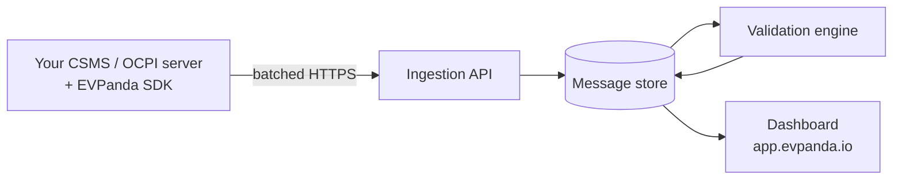

EVPanda is an observability platform for EV charging infrastructure. You embed an SDK in the systems you already run — your OCPP CSMS, your OCPI server — and EVPanda records the protocol traffic that flows through them, validates every message, and gives your team one place to search it.

An online charger isn't necessarily a working one. Neither is a roaming partner that returns `200 OK` on every call. EVPanda tells you the difference.

<Columns cols={2}>
  <Card title="Get started" icon="rocket" href="/integration/getting-started" horizontal>
    Install an SDK and send your first captured message.
  </Card>

  <Card title="Core concepts" icon="shapes" href="/concepts/networks" horizontal>
    Networks, identity, and what the SDK records.
  </Card>
</Columns>

## What you get

<Columns cols={2}>
  <Card title="A searchable message log" icon="list" horizontal>
    Every OCPP frame and OCPI exchange, decoded and indexed — searchable by charger, roaming partner, tenant, action, or tag.
  </Card>

  <Card title="Protocol validation" icon="shield-check" horizontal>
    Each message checked against OCPP 1.6 and OCPI 2.2.1 rules, well past schema, into cross-field and cross-message logic.
  </Card>

  <Card title="Behavioral anomalies" icon="activity" horizontal>
    Traffic that breaks no rule but breaks your network — silent chargers, unanswered calls, sequences that never complete.
  </Card>

  <Card title="Failure attribution" icon="crosshair" horizontal>
    Every issue tied to the charger or partner it came from, so you stop guessing whose side the problem is on.
  </Card>
</Columns>

## Supported protocols

| Protocol | Version | What EVPanda records |
| --- | --- | --- |
| OCPP | 1.6 (JSON over WebSocket) | Every frame in both directions, plus connect and disconnect events, grouped into connections |
| OCPI | 2.2.1 | Every HTTP request/response exchange with a roaming partner, in both directions |

SDKs ship for **Go**, **Node**, and **Python**. See [Getting started](/integration/getting-started) for versions and availability.

## How it works

Four moving parts, and traffic flows one way through them.

<Steps>
  <Step title="The SDK captures">
    You call it where you already handle protocol traffic — a WebSocket read loop for OCPP, an HTTP handler or client for OCPI. Each capture validates the identity, enforces a size cap, redacts secrets, buffers the message, and returns. No network call happens on your thread.
  </Step>

  <Step title="The SDK delivers">
    One background worker per client flushes when a full batch of 1,000 messages is waiting or the flush interval elapses, compresses it, and POSTs it. Failed deliveries retry with capped backoff; under sustained failure the SDK drops its own oldest captures rather than growing without limit.
  </Step>

  <Step title="The ingestion API accepts">
    It authenticates the batch, validates each message independently, and writes the valid ones to durable storage before returning. It never asks your SDK to retry a batch that will always fail.
  </Step>

  <Step title="The validation engine analyzes">
    Stored messages are checked against protocol-aware rules built for OCPP 1.6 and OCPI 2.2.1. Findings become issues, grouped by type.
  </Step>

  <Step title="The dashboard shows">
    Messages, issues, chargers, and roaming platforms — with one search box across all of them.
  </Step>
</Steps>

<Note>
  Capture is passive. The SDK is not a proxy and not middleware in the protocol sense — it never rewrites a frame, alters a response, delays a handler, or fails a request because EVPanda is unreachable.
</Note>

## Issues

An issue is a finding about one message, grouped with every other occurrence of the same finding. A charger that sends a malformed `StatusNotification` ten thousand times produces one issue with a count of ten thousand — not ten thousand rows.

Each group carries a severity, the validation stage and message part it came from, the charger or platform it affects, a 7-day occurrence trend, and a link straight to the messages that triggered it.

<Columns cols={3}>
  <Card title="Error" icon="circle-x" horizontal>
    The message violates the protocol. A conforming implementation would not have sent it.
  </Card>

  <Card title="Warning" icon="triangle-alert" horizontal>
    Legal but questionable — a missing optional field the spec says you *should* send, a value that looks wrong.
  </Card>

  <Card title="Anomaly" icon="activity" horizontal>
    Nothing breaks a rule, but the behavior around it does. This is the class that catches "online but not working".
  </Card>
</Columns>

### What gets caught

<Tabs>
  <Tab title="OCPP">
    | Finding | Why it matters |
    | --- | --- |
    | `call_response_timeout` | You sent a `CALL` and the charge point never answered. It looks online and is not responding. |
    | `unanswered_call_on_disconnect` | The socket dropped with calls outstanding — work you believed was accepted never happened. |
    | `duplicate_unique_id` | Two in-flight calls reused one message ID, so responses can't be matched reliably. |
    | `message_type_code` | The frame isn't a valid OCPP-J `CALL`, `CALLRESULT`, or `CALLERROR`. |
    | `required_field` | A field the action requires is missing from the payload. |

    Cross-field rules catch what schemas can't: a `TxProfile` charging profile set on connector `0`, a `StatusNotification` reporting a connector-specific status on connector `0`, a `connectorId` outside the range the charger reported at boot.
  </Tab>

  <Tab title="OCPI">
    | Finding | Why it matters |
    | --- | --- |
    | `known_endpoint` | The request targets a path that isn't part of OCPI 2.2.1. |
    | `method_allowed` | The method isn't valid for that endpoint — a `PUT` where the module only accepts `PATCH`. |
    | `ocpi_envelope` | The response body isn't a well-formed OCPI envelope, or is missing `status_code`. |
    | `error_code` | The OCPI `status_code` doesn't match the HTTP status or the situation it describes. |
    | `payload_schema` | A field has the wrong type or an invalid value — a bad country code, a malformed timestamp. |

    Because an OCPI capture holds the whole request/response pair, the exchange is validated as a unit: a `200 OK` carrying an error envelope, or a response that doesn't match what the request asked for.
  </Tab>
</Tabs>

Two per-network settings shape the issue stream — **anomaly detection** and **reject unknown JSON fields** — along with the OCPP call and idle timeouts. See [Networks](/concepts/networks#network-settings).

## Tags and search

While validating, the pipeline extracts **tags**: the identifiers that matter inside a payload, pulled from the URL, headers, body, or connection. Session IDs, location IDs, transaction IDs, and token IDs all become searchable.

That is what makes the global search box useful during an incident — paste a session ID from a customer complaint and get every message across both protocols that touched it.

## Where to go next

<Columns cols={2}>
  <Card title="Networks" icon="network" href="/concepts/networks">
    How EVPanda organizes your systems, and how to get an API key.
  </Card>

  <Card title="Identity" icon="fingerprint" href="/concepts/identity">
    How every message is attributed to a charger, a partner, and a tenant.
  </Card>

  <Card title="What gets captured" icon="scan-line" href="/concepts/capture-model">
    Event shapes, redaction, size limits, and retention.
  </Card>

  <Card title="Getting started" icon="rocket" href="/integration/getting-started">
    Install an SDK, configure it, and instrument your service.
  </Card>
</Columns>
