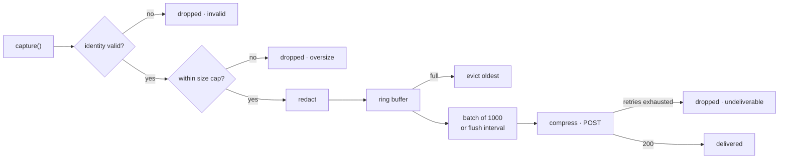

Instrumenting a service takes three things: a network and an API key from the dashboard, an SDK in your process, and a few capture calls where you already handle protocol traffic.

This page covers everything the two protocols share. When you're ready to write code, go to the guide for the protocol your service speaks.

<Columns cols={2}>
  <Card title="OCPP server" icon="plug-zap" href="/integration/ocpp" horizontal>
    Capture WebSocket frames from your charge points.
  </Card>

  <Card title="OCPI server" icon="network" href="/integration/ocpi" horizontal>
    Capture roaming exchanges with your partners.
  </Card>
</Columns>

## Supported languages

| SDK | Package | Requires | Status |
| --- | --- | --- | --- |
| **Go** | `github.com/evpanda-labs/evpanda-go` | Go 1.24+ | Published, stable |
| **Node** | `@evpanda/sdk` | Node 18+ | `0.1.0` pending publish |
| **Python** | `evpanda` | Python 3.12+ | Preview, install from source |

<CodeGroup>
  ```bash Go
  go get github.com/evpanda-labs/evpanda-go
  ```

  ```bash Node
  npm add @evpanda/sdk
  ```

  ```bash Python
  pip install "evpanda[zstd]"
  ```
</CodeGroup>

<Note>
  **Availability, honestly.** The Go SDK is published and is the reference implementation the others track.

  The npm registry currently serves an older `@evpanda/sdk`; the API documented here is `0.1.0`. Until it ships, the OCPP session handle and the OCPI adapters are not available — the flat capture calls are.

  The Python SDK is not on PyPI yet. Install it from source, and note it has no HTTP adapters:

  ```bash
  pip install "git+https://github.com/evpanda-labs/evpanda-py"
  ```
</Note>

<Card title="Source and API reference" icon="github" horizontal>
  [evpanda-go](https://github.com/evpanda-labs/evpanda-go) · [pkg.go.dev](https://pkg.go.dev/github.com/evpanda-labs/evpanda-go) · [evpanda-node](https://github.com/evpanda-labs/evpanda-node) · [evpanda-py](https://github.com/evpanda-labs/evpanda-py)
</Card>

### Optional compression dependency

Compression defaults to zstd, which needs one optional package in Node and Python. Without it the SDK falls back to gzip silently.

| SDK | To get zstd |
| --- | --- |
| Go | Included |
| Node | `npm add @mongodb-js/zstd` |
| Python | `pip install "evpanda[zstd]"` |

## What the SDK does

The SDK is passive. It observes traffic your application already handles — it never sits in the request path, never blocks on the network, and never fails your process if EVPanda is unreachable.

<AccordionGroup>
  <Accordion title="Capture never blocks your application" icon="gauge">
    A capture call validates the identity, enforces a size cap, redacts secrets, copies the payload, writes it to an in-process buffer, and returns. No I/O, no locks your code contends on. Delivery happens on a background worker.
  </Accordion>

  <Accordion title="Memory is capped, and the SDK drops its own data first" icon="database">
    The buffer has a ceiling you set. When delivery stalls the SDK evicts its oldest captures rather than growing without limit or applying backpressure to your service.
  </Accordion>

  <Accordion title="Secrets never leave your process" icon="lock">
    OCPI headers pass through an allowlist before anything is buffered, so `Authorization`, `Cookie`, and API keys are dropped at capture. Tokens in OCPI `/credentials` bodies are masked. See [What gets captured](/concepts/capture-model).
  </Accordion>

  <Accordion title="A bad config can't crash your boot" icon="shield">
    If the endpoint or API key is wrong the client starts **inert**: every capture is a no-op and the error is reported to you. Your service still boots.
  </Accordion>
</AccordionGroup>

## Get an API key

A network is the container for everything EVPanda records about one of your systems, and an API key is scoped to exactly one network.

<Steps>
  <Step title="Create a network">
    In [app.evpanda.io](https://app.evpanda.io), create a **Charger network** for an OCPP CSMS or a **Roaming network** for an OCPI server. One per system, per environment.
  </Step>

  <Step title="Generate a key">
    Open the network's **Settings** tab and generate a key. The raw value — `evp_sk_…` — is shown once. EVPanda stores only a hash of it.
  </Step>

  <Step title="Put it in the environment">
    ```bash
    export EVPANDA_API_KEY="evp_sk_..."
    ```

    Every SDK falls back to `EVPANDA_API_KEY` when no key is passed in code, which keeps the key out of your source.
  </Step>
</Steps>

See [Networks](/concepts/networks) for network settings, key rotation, and what a key can and cannot do.

## Start a client

The protocol is the client. `OCPI` and `OCPP` have separate client types, separate configs, and separate API keys. Start one at boot and share it across your process — each client runs its own background worker and its own buffer.

<CodeGroup>
  ```go Go
  import evpanda "github.com/evpanda-labs/evpanda-go"

  // APIKey omitted → read from EVPANDA_API_KEY.
  panda, err := evpanda.StartOCPP(evpanda.OCPPConfig{
      BaseConfig: evpanda.BaseConfig{Endpoint: "https://ingest.evpanda.io"},
  })
  if err != nil {
      log.Printf("evpanda: %v (running inert)", err)
  }
  defer func() { _ = panda.Close() }()
  ```

  ```ts Node
  import { OCPPClient } from "@evpanda/sdk";

  // apiKey omitted → read from EVPANDA_API_KEY.
  export const panda = OCPPClient.start({
    endpoint: "https://ingest.evpanda.io",
    debug: process.env.NODE_ENV !== "production",
  });
  ```

  ```python Python
  from evpanda import OCPPClient, OCPPConfig

  # api_key omitted → read from EVPANDA_API_KEY.
  panda = OCPPClient.start(
      OCPPConfig(endpoint="https://ingest.evpanda.io", debug=True)
  )
  ```
</CodeGroup>

Swap `OCPP` for `OCPI` if that's what your service speaks. Both clients are safe for concurrent use.

<Warning>
  **Log the startup error.** An inert client behaves exactly like a healthy one on an idle system — silent, no panics, no failures — so a swallowed config error looks identical to "no traffic yet".

  In Go the error comes back from `Start*`. In Node and Python nothing is reported unless `debug` is on, which is why both examples above turn it on.
</Warning>

## Configuration

`endpoint` and `apiKey` are hard-required. Every other option is a **tunable**: an out-of-range value falls back to its default and says so in the logs, rather than failing.

| Purpose | Go | Node | Python | Default |
| --- | --- | --- | --- | --- |
| Ingestion base URL | `Endpoint` | `endpoint` | `endpoint` | required |
| API key | `APIKey` | `apiKey` | `api_key` | `$EVPANDA_API_KEY` |
| Buffer ceiling | `MaxBufferBytes` | `bufferCapacity` | `buffer_capacity` | 32 MiB / 10,000 msgs |
| Per-capture cap | `MaxCaptureBytes` | `maxCaptureBytes` | `max_capture_bytes` | 65536 bytes |
| Flush cadence | `FlushInterval` | `flushInterval` | `flush_interval` | 5s / 5000ms / 5.0s |
| Drain deadline | `DrainTimeout` | `drainTimeout` | `drain_timeout` | 10s, minimum 5s |
| Compression | `Compression` | `compression` | `compression` | `zstd` |
| Log verbosity | `LogMode` | `debug` | `debug` | see below |
| Log destination | `Logger` | `logger` | `logger` | `slog.Default()` / `console` |
| Extra OCPI headers | `OCPIAllowedHeaders` | `ocpiAllowedHeaders` | `ocpi_allowed_headers` | none |

<Tabs>
  <Tab title="Go">
    Intervals are `time.Duration`. The buffer is capped **by bytes**, so the number you set is the memory footprint, not an estimate of it.

    ```go
    evpanda.StartOCPI(evpanda.OCPIConfig{
        BaseConfig: evpanda.BaseConfig{
            Endpoint:       "https://ingest.evpanda.io",
            MaxBufferBytes: 64 << 20, // 64 MiB
            FlushInterval:  2 * time.Second,
            LogMode:        evpanda.LogModeDebug,
        },
        OCPIAllowedHeaders: []string{"x-trace-id"},
    })
    ```

    `LogMode` is `LogModeSilent`, `LogModeErrors` (default), or `LogModeDebug`. The `EVPANDA_LOG` environment variable sets it without a code change; an explicit config value wins.
  </Tab>

  <Tab title="Node">
    Intervals are **milliseconds**. The buffer is capped **by message count**, so worst-case memory is roughly `bufferCapacity × maxCaptureBytes`.

    ```ts
    OCPIClient.start({
      endpoint: "https://ingest.evpanda.io",
      bufferCapacity: 50_000,
      flushInterval: 2_000,
      debug: true,
      logger: pino({ name: "evpanda" }),
      ocpiAllowedHeaders: ["x-trace-id"],
    });
    ```

    `debug` is a master switch — with it off, the SDK is completely silent, including about config errors. The logger interface is four methods (`debug`, `info`, `warn`, `error`), so pino, winston, bunyan, and `console` all satisfy it.
  </Tab>

  <Tab title="Python">
    Intervals are float **seconds**, matching `time.sleep` and socket timeouts. The buffer is capped **by message count**.

    ```python
    OCPIClient.start(
        OCPIConfig(
            endpoint="https://ingest.evpanda.io",
            buffer_capacity=50_000,
            flush_interval=2.0,
            debug=True,
            logger=logging.getLogger("evpanda"),
            ocpi_allowed_headers=["x-trace-id"],
        )
    )
    ```

    `debug` is a master switch — with it off, the SDK is completely silent. With `logger=None` it uses `logging.getLogger("evpanda")`.
  </Tab>
</Tabs>

### Sizing the buffer

The buffer absorbs a delivery stall. Size it for how long you want to survive one: `message rate × average size × seconds`.

At 400 messages/second and 500 bytes each — roughly a 10,000-charger CSMS — one minute of stalled delivery is about 12 MB. The 32 MiB Go default covers about two and a half minutes of that: enough for a blip, small enough for an ordinary container limit.

<Warning>
  Don't set the buffer ceiling below the per-capture cap. A full-size capture could then never fit, so every large message would be dropped after being redacted.
</Warning>

## How delivery works



One background worker per client owns delivery. It flushes when 1,000 messages are waiting or the flush interval elapses, whichever comes first, compresses the batch, and POSTs it to `https://ingest.evpanda.io`.

| Response | Treated as |
| --- | --- |
| `200` | Delivered |
| `400`, `401`, `413` | **Permanent** — dropped immediately, never retried |
| `5xx`, network error, timeout | Retried with jittered exponential backoff, five attempts |

Retries are deliberately not configurable: an SDK on a customer's hot path that retries aggressively against a struggling API turns a partial outage into a full one.

### Where data can be lost

Five places, all counted:

| Counter | Cause |
| --- | --- |
| `DroppedInvalid` | Identity failed validation |
| `DroppedOversize` | Body or frame over the per-capture cap |
| `DroppedEvicted` | Buffer full, oldest evicted |
| `DroppedUndeliverable` | Retries exhausted, or a permanent rejection |
| `DroppedPanic` | A recovered panic inside the SDK — a bug, please report it |

## Shut down cleanly

Stop accepting traffic first, then drain. Draining while chargers or partners are still sending is a race you'll lose.

<CodeGroup>
  ```go Go
  srv.Shutdown(ctx)                  // stop accepting…
  if err := panda.Shutdown(ctx); err != nil {
      log.Printf("evpanda: %v", err) // …then drain
  }
  ```

  ```ts Node
  server.close();
  await panda.close();
  ```

  ```python Python
  server.shutdown()
  panda.close()
  ```
</CodeGroup>

Close is idempotent, and captures made after it are safe no-ops.

<Warning>
  **Node:** `close()` returns a promise. Not awaiting it is the difference between draining the buffer and discarding it.

  **Go:** `Shutdown(ctx)` uses your context's deadline; `Close()` uses the configured `DrainTimeout`. Both return `ErrDrainIncomplete` if the deadline passed with messages still buffered.

  **Python:** `close()` blocks while it drains, up to `drain_timeout`. Call it from your shutdown path, not from a request handler.
</Warning>

`flush()` forces an immediate delivery and waits for it — useful in tests and at shutdown, never on a request path.

## Check that it's working

<Steps>
  <Step title="Confirm the client is live, not inert">
    In Go, the error from `Start*` is nil. In Node and Python, `debug` is on and no config error appeared at startup.
  </Step>

  <Step title="Drive real traffic">
    Connect a charge point, or make one OCPI call in each direction. Synthetic traffic that skips your auth layer won't exercise identity resolution — the part that usually breaks.
  </Step>

  <Step title="Wait one flush interval">
    Five seconds by default, or call `flush()`.
  </Step>

  <Step title="Check the dashboard">
    Messages appear under your network. Chargers and platforms are created automatically the first time they send traffic, so a new entity appearing is itself confirmation.
  </Step>

  <Step title="Check both directions">
    The step people skip. Confirm you see frames you sent as well as frames you received. Half-instrumented is the most common production state, and it silently disables the most valuable checks.
  </Step>
</Steps>

### Counters and logs

Go exposes the delivery counters directly, on any client — including an inert or closed one:

```go
s := panda.Stats()
log.Printf("evpanda: captured=%d invalid=%d oversize=%d evicted=%d undeliverable=%d buffered=%d",
    s.Captured, s.DroppedInvalid, s.DroppedOversize,
    s.DroppedEvicted, s.DroppedUndeliverable, s.BufferedMessages)
```

They are always on, so you can feed them straight into your metrics:

```go
prometheus.MustRegister(prometheus.NewCounterFunc(
    prometheus.CounterOpts{Name: "evpanda_dropped_total"},
    func() float64 { return float64(panda.Stats().TotalDropped()) },
))
```

Go also logs by default, at a bounded rate — at most one summary line per minute, and nothing at all while healthy:

```
level=WARN msg="evpanda: captures dropped" window=1m0s captured=12 invalid_identity=148302 buffered=0 buffer_bytes=0
```

<Note>
  **Node and Python don't expose a counters API yet.** Turn on `debug` to get the same picture in your logs, and use the dashboard's message volume to confirm an integration is healthy.
</Note>

### What to alert on

| Alert | Condition |
| --- | --- |
| Capture stalled | `Captured` flat while your service is serving traffic |
| Identity failures | `DroppedInvalid` rising — identity resolution regressed |
| Delivery failing | `DroppedUndeliverable` rising — network, egress, or a revoked key |
| Buffer pressure | Buffer sustained above half the ceiling; eviction is next |

Alert on rates, not totals: the counters are monotonic since client start, so a total tells you something once went wrong while a rate tells you it is going wrong now.

## Troubleshooting

<AccordionGroup>
  <Accordion title="Nothing arrives, and Captured is 0" icon="power-off">
    Either the client is inert or the capture calls aren't running.

    Check the startup error (Go) or turn on `debug` (Node, Python). Confirm `EVPANDA_API_KEY` is set in the environment your service actually runs in — set in your shell, absent from the container is the classic miss — and that `endpoint` is `https://ingest.evpanda.io` with no path.
  </Accordion>

  <Accordion title="Nothing arrives, and DroppedInvalid is climbing" icon="fingerprint">
    Identity resolution is failing. This is the most common integration fault by a wide margin.

    For OCPI, the usual cause is a capture adapter mounted **before** the middleware that authenticates the partner, so nothing has an identity yet. Move capture after auth. See [Identity](/concepts/identity).
  </Accordion>

  <Accordion title="Nothing arrives, and DroppedUndeliverable is climbing" icon="cloud-off">
    Capture works, delivery doesn't. Check egress first:

    ```bash
    curl -sS https://ingest.evpanda.io/health
    # {"status":"ok"}
    ```

    If that fails, allowlist `ingest.evpanda.io` on port 443. If it succeeds, suspect the key: a revoked or wrong-protocol key returns `401`, which is permanent and never retried. An OCPP client needs a charger network's key; an OCPI client needs a roaming network's key.
  </Accordion>

  <Accordion title="Messages deliver but don't show up" icon="file-x">
    The ingestion API validates each message independently and reports `{"captured": N, "failed": M}`. Messages counted in `failed` were rejected after a successful delivery.

    Usual causes, in order:

    - **An OCPP message with no tenant pair.** The API currently requires `tenant_id` and `tenant_name` on OCPP messages even though the SDKs treat them as optional.
    - **An OCPI exchange with no status code.** It must be between 100 and 599; there is no null form.
    - **An identity field over its limit.** Tenant name is 32 characters; the rest are 64.

    See [Identity](/concepts/identity#tenants).
  </Accordion>

  <Accordion title="Only half the traffic appears" icon="arrow-down">
    You are capturing one direction. For OCPP, that means the write path isn't instrumented; for OCPI, that the outbound HTTP client isn't wrapped.

    It matters more than it looks: without both directions the validation engine can't pair requests with responses, so you lose every timeout, orphan, and duplicate-ID finding.
  </Accordion>

  <Accordion title="Bodies are missing or truncated" icon="ruler">
    A body or frame over `maxCaptureBytes` (64 KiB by default) drops the **whole message** rather than storing a truncated one. Raise the cap — 256 KiB is reasonable for a roaming server — and raise the buffer ceiling with it.
  </Accordion>

  <Accordion title="Memory grew after adding the SDK" icon="database">
    Expected and bounded: the buffer holds undelivered captures up to its ceiling. If that's more than your pod can afford, lower the ceiling. A healthy client idles far below it.
  </Accordion>
</AccordionGroup>

Still stuck? Mail [support@evpanda.io](mailto:support@evpanda.io) with the SDK and version, the network name and protocol, and a counter snapshot or debug log covering a minute of live traffic.

## No SDK for your language?

The ingestion API is a small HTTP contract: two routes, one auth header, one response shape.

```bash
curl -sS https://ingest.evpanda.io/v1/ocpp \
  -H "X-API-Key: $EVPANDA_API_KEY" \
  -H "Content-Type: application/json" \
  -d '{"messages":[ ... ]}'
# {"captured":1,"failed":0}
```

`POST /v1/ocpp` and `POST /v1/ocpi` each take up to 1,000 messages per batch, optionally gzip- or zstd-compressed, capped at 5 MB compressed and 20 MB decompressed. Mail [support@evpanda.io](mailto:support@evpanda.io) for the full message schemas.

If you implement your own client, copy the behaviors that make an SDK safe on a hot path: never block the caller, bound your memory, batch, retry only `5xx` and network errors, redact before you buffer, and count what you drop.

## Next

<Columns cols={2}>
  <Card title="OCPP server" icon="plug-zap" href="/integration/ocpp">
    The full integration, step by step, in Go, Node, and Python.
  </Card>

  <Card title="OCPI server" icon="network" href="/integration/ocpi">
    The same, plus the drop-in HTTP adapters.
  </Card>
</Columns>
