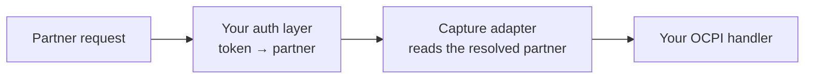

OCPI is symmetric: you are a server to your roaming partners and a client to them, often within the same request. EVPanda records both sides.

<Note>
  Everything shared across protocols — installing the SDK, getting an API key, configuration, monitoring, shutdown — is in [Getting started](/integration/getting-started). This page is the OCPI-specific part.
</Note>

## The model

The direction is never something you pass. It follows from the method you call.

| You call | Direction | You are the… | Typical case |
| --- | --- | --- | --- |
| `captureInboundMessage` | `IN` | server | An eMSP pushes a CDR or session update to your endpoint |
| `captureOutboundMessage` | `OUT` | client | You pull a partner's locations, or post a token authorization |

<Warning>
  In **both** directions, identity is the **partner on the other side of the exchange** — never your own platform. When Acme pushes you a CDR, the identity is Acme. When you pull Acme's locations, the identity is still Acme.
</Warning>

## Where identity comes from

Your OCPI server already knows who is calling: you looked the partner up by their Token A or Token B to decide whether to serve the request at all. That lookup is your identity source.



The order matters. Adapters resolve identity once per request, so they must run **after** whatever authenticates the partner. Mounted the other way around, no request has an identity yet, every message is dropped, and you see nothing in the dashboard.

<Note>
  A request with no resolvable identity is served exactly as it would have been. The adapters never block, alter, or fail a request on EVPanda's account — they simply don't capture it.
</Note>

## What ships per language

| SDK | Inbound (you are the server) | Outbound (you are the client) |
| --- | --- | --- |
| **Go** | `ocpi.Middleware` — standard `func(http.Handler) http.Handler` | `ocpi.RoundTripper` — wraps any `http.RoundTripper` |
| **Node** | `ocpi.express` — connect-style `(req, res, next)` | `ocpi.fetch`, `ocpi.axios` |
| **Python** | *No adapter yet* — call the capture methods directly | *No adapter yet* — call the capture methods directly |

The Go middleware is the stdlib shape, so it drops into net/http, chi, and gorilla/mux directly and into echo and gin through their wrappers. The Node express adapter is typed against `node:http`, so it works on connect too, with no express dependency.

For anything else — koa, hono, fastify, FastAPI, Django — skip the adapter and [call the capture methods yourself](#capturing-without-the-adapters). It is a few lines, and you hand the identity over directly instead of resolving it.

## Integration steps

<Steps>
  <Step title="Start one client at boot">
    <CodeGroup>
      ```go Go
      import (
          evpanda "github.com/evpanda-labs/evpanda-go"
          "github.com/evpanda-labs/evpanda-go/ocpi" // HTTP adapters
      )

      panda, err := evpanda.StartOCPI(evpanda.OCPIConfig{
          BaseConfig: evpanda.BaseConfig{Endpoint: "https://ingest.evpanda.io"},
      })
      if err != nil {
          log.Printf("evpanda: %v (running inert)", err)
      }
      defer func() { _ = panda.Close() }()
      ```

      ```ts Node
      import { OCPIClient, ocpi } from "@evpanda/sdk";

      export const panda = OCPIClient.start({
        endpoint: "https://ingest.evpanda.io",
        debug: process.env.NODE_ENV !== "production",
      });
      ```

      ```python Python
      from evpanda import OCPIClient, OCPIConfig

      panda = OCPIClient.start(
          OCPIConfig(endpoint="https://ingest.evpanda.io", debug=True)
      )
      ```
    </CodeGroup>

    The client needs a **roaming network** API key. A charger network's key is rejected.
  </Step>

  <Step title="Teach the SDK how to find the partner">
    Each SDK has its own hook into your existing partner lookup.

    <CodeGroup>
      ```go Go
      // Stamp the identity on the request context in the middleware that
      // already authenticates the partner. The default resolver reads it.
      func auth(next http.Handler) http.Handler {
          return http.HandlerFunc(func(w http.ResponseWriter, r *http.Request) {
              partner, ok := lookupPartner(r.Header.Get("Authorization"))
              if !ok {
                  http.Error(w, "unknown partner", http.StatusUnauthorized)
                  return
              }

              ctx := ocpi.ContextWithIdentity(r.Context(), evpanda.RoamingIdentity{
                  PlatformID:   partner.ID,
                  PlatformName: partner.Name,
              })
              next.ServeHTTP(w, r.WithContext(ctx))
          })
      }
      ```

      ```ts Node
      // Write the resolver once and pass it to every adapter.
      import type { OCPIResolver } from "@evpanda/sdk";

      export const resolvePartner: OCPIResolver = ({ requestHeaders }) => {
        const partner = lookupPartner(requestHeaders.authorization);
        return {
          platformId: partner?.id ?? "",
          platformName: partner?.name ?? "",
        };
      };
      ```

      ```python Python
      # No adapters yet, so there is no resolver — you pass the identity
      # straight to the capture call.
      def resolve_partner(request) -> RoamingIdentity | None:
          partner = lookup_partner(request.headers.get("authorization"))
          if partner is None:
              return None
          return RoamingIdentity(
              platform_id=partner.id, platform_name=partner.name
          )
      ```
    </CodeGroup>

    Returning nothing — or an identity that fails validation, such as an empty platform name — means the exchange is not captured. The request itself is never blocked.
  </Step>

  <Step title="Capture inbound traffic">
    Mount capture **after** your auth layer.

    <CodeGroup>
      ```go Go
      mux := http.NewServeMux()
      mux.Handle("POST /ocpi/2.2/cdrs", cdrHandler)

      srv := &http.Server{
          Addr:    ":8080",
          Handler: auth(ocpi.Middleware(panda)(mux)),
      }
      ```

      ```ts Node
      const app = express();

      app.use(express.json());        // a body parser must come first
      app.use(authenticatePartner);   // then your auth layer
      app.use(ocpi.express(panda, { resolve: resolvePartner }));

      app.post("/ocpi/2.2/cdrs", handleCdr);
      ```

      ```python Python
      # Starlette applies middleware outside-in, so the LAST one added
      # runs first — auth must be added after capture.
      app.add_middleware(EVPandaMiddleware)
      app.add_middleware(AuthMiddleware)
      ```
    </CodeGroup>

    The Go middleware records the request body as your handler reads it, tees the response on its way out, and ships one message when the handler returns — including when the handler panics, so the exchange that broke your server is still recorded.
  </Step>

  <Step title="Capture outbound traffic">
    Instrument the HTTP client your OCPI calls actually go through.

    <CodeGroup>
      ```go Go
      client := &http.Client{
          Transport: ocpi.RoundTripper(panda, nil), // nil base → DefaultTransport
          Timeout:   30 * time.Second,
      }

      ctx = ocpi.ContextWithIdentity(ctx, evpanda.RoamingIdentity{
          PlatformID: partner.ID, PlatformName: partner.Name,
      })
      req, _ := http.NewRequestWithContext(ctx, http.MethodPost, partner.URL+"/sessions", body)
      req.Header.Set("Authorization", "Token "+partner.TokenB)

      resp, err := client.Do(req)
      if err != nil {
          return err
      }
      defer resp.Body.Close() // capture completes when the body is closed
      ```

      ```ts Node
      // fetch — returns a NEW function; globalThis.fetch is untouched.
      const fetch = ocpi.fetch(panda, globalThis.fetch, {
        resolve: resolvePartner,
      });

      // axios — instruments the instance you pass, and returns it.
      const partnerApi = ocpi.axios(
        panda,
        axiosLib.create({ baseURL: partner.baseUrl }),
        { resolve: resolvePartner },
      );
      ```

      ```python Python
      async def call_partner(partner, method, path, json=None):
          async with httpx.AsyncClient(base_url=partner.base_url) as client:
              response = await client.request(
                  method, path, json=json,
                  headers={"authorization": f"Token {partner.token_b}"},
              )

          panda.capture_outbound_message(
              OCPIMessageInput(
                  identity=RoamingIdentity(
                      platform_id=partner.id, platform_name=partner.name
                  ),
                  data=HttpExchange(
                      method=response.request.method,
                      url=str(response.request.url),
                      status_code=response.status_code,
                      request_headers=dict(response.request.headers),
                      response_headers=dict(response.headers),
                      request_body=response.request.content,
                      response_body=response.content,
                  ),
              )
          )
          return response
      ```
    </CodeGroup>

    <Warning>
      **Close your response bodies.** Outbound capture completes when the body is read to the end or closed, so a leaked body is also a message that never ships. A call that fails at the transport layer — DNS, connection refused, timeout — captures nothing: there was no exchange to record.
    </Warning>
  </Step>
</Steps>

## A complete example

<Tabs>
  <Tab title="Go">
    ```go server.go
    package main

    import (
        "net/http"
        "strings"
        "time"

        evpanda "github.com/evpanda-labs/evpanda-go"
        "github.com/evpanda-labs/evpanda-go/ocpi"
    )

    func main() {
        panda, err := evpanda.StartOCPI(evpanda.OCPIConfig{
            BaseConfig: evpanda.BaseConfig{Endpoint: "https://ingest.evpanda.io"},
        })
        if err != nil {
            log.Printf("evpanda: %v (running inert)", err)
        }
        defer func() { _ = panda.Close() }()

        mux := http.NewServeMux()
        mux.Handle("POST /ocpi/2.2/cdrs", cdrHandler)
        mux.Handle("PUT /ocpi/2.2/sessions/{id}", sessionHandler)

        // auth on the outside, capture on the inside.
        srv := &http.Server{Addr: ":8080", Handler: auth(ocpi.Middleware(panda)(mux))}

        // Outbound calls to partners.
        client := &http.Client{
            Transport: ocpi.RoundTripper(panda, nil),
            Timeout:   30 * time.Second,
        }
        _ = client

        log.Fatal(srv.ListenAndServe())
    }

    func auth(next http.Handler) http.Handler {
        return http.HandlerFunc(func(w http.ResponseWriter, r *http.Request) {
            partner, ok := lookupPartner(r.Header.Get("Authorization"))
            if !ok {
                http.Error(w, "unknown partner", http.StatusUnauthorized)
                return
            }
            ctx := ocpi.ContextWithIdentity(r.Context(), evpanda.RoamingIdentity{
                PlatformID:   partner.ID,
                PlatformName: partner.Name,
            })
            next.ServeHTTP(w, r.WithContext(ctx))
        })
    }
    ```

    **Custom resolvers.** If identity lives somewhere the default resolver can't see — a client certificate, a path prefix, a subdomain — pass your own. Returning `false` means "don't capture this one".

    ```go
    byPath := func(r *http.Request) (evpanda.RoamingIdentity, bool) {
        name, ok := strings.CutPrefix(r.URL.Path, "/partners/")
        if !ok {
            return evpanda.RoamingIdentity{}, false
        }
        return evpanda.RoamingIdentity{PlatformID: name, PlatformName: name}, true
    }

    ocpi.Middleware(panda, ocpi.WithResolver(byPath))
    ocpi.RoundTripper(panda, nil, ocpi.WithResolver(byPath))
    ```

    **Other routers.** The middleware is the stdlib shape, so it composes with everything:

    ```go
    r.Use(auth); r.Use(ocpi.Middleware(panda))              // chi
    r.Use(auth, ocpi.Middleware(panda))                     // gorilla/mux
    e.Use(echo.WrapMiddleware(auth))                        // echo
    e.Use(echo.WrapMiddleware(ocpi.Middleware(panda)))

    // gin: an engine is an http.Handler — wrap it, auth on the outside.
    srv := &http.Server{Handler: auth(ocpi.Middleware(panda)(engine))}
    ```
  </Tab>

  <Tab title="Node">
    ```ts server.ts
    import express from "express";
    import axiosLib from "axios";
    import { OCPIClient, ocpi } from "@evpanda/sdk";

    import type { OCPIResolver } from "@evpanda/sdk";

    const panda = OCPIClient.start({
      endpoint: "https://ingest.evpanda.io",
      debug: process.env.NODE_ENV !== "production",
    });

    // Written once, passed to every adapter.
    const resolvePartner: OCPIResolver = ({ requestHeaders }) => {
      const partner = lookupPartner(requestHeaders.authorization);
      return {
        platformId: partner?.id ?? "",
        platformName: partner?.name ?? "",
      };
    };

    const app = express();

    app.use(express.json());       // 1. body parser — the adapter reads req.body
    app.use(authenticatePartner);  // 2. your auth layer
    app.use(ocpi.express(panda, { resolve: resolvePartner })); // 3. capture

    app.post("/ocpi/2.2/cdrs", handleCdr);

    // Outbound — instrument whichever client you actually use.
    export const fetch = ocpi.fetch(panda, globalThis.fetch, {
      resolve: resolvePartner,
    });

    export const partnerApi = ocpi.axios(
      panda,
      axiosLib.create({ baseURL: "https://partner.example" }),
      { resolve: resolvePartner },
    );

    process.on("SIGTERM", async () => {
      await panda.close();
      process.exit(0);
    });
    ```

    Because `ocpi.fetch` returns a plain `fetch`, any client that accepts one is instrumented too:

    ```ts
    const api = ky.create({ fetch });        // ky
    const $api = ofetch.create({ fetch });   // ofetch
    ```

    **One partner per client?** Set the identity headers as instance defaults and skip the resolver. The adapters strip these before dispatch, so the partner never receives them.

    ```ts
    ocpi.axios(panda, axiosLib.create({
      baseURL: partner.baseUrl,
      headers: {
        "X-EVPanda-Platform-Id": partner.id,
        "X-EVPanda-Platform-Name": partner.name,
      },
    }));
    ```
  </Tab>

  <Tab title="Python">
    There are no adapters yet, so a middleware is the one place that sees the whole exchange. This is FastAPI and Starlette; the shape is the same for Django or Flask.

    ```python middleware.py
    from starlette.middleware.base import BaseHTTPMiddleware
    from starlette.requests import Request
    from starlette.responses import Response

    from evpanda import HttpExchange, OCPIMessageInput, RoamingIdentity

    from evpanda_client import panda


    class EVPandaMiddleware(BaseHTTPMiddleware):
        """Capture inbound OCPI exchanges. Mount it so it runs inside your
        authentication middleware."""

        async def dispatch(self, request: Request, call_next):
            identity = resolve_partner(request)
            if identity is None:
                return await call_next(request)  # not captured, served normally

            request_body = await request.body()
            response = await call_next(request)

            # Drain the streaming response so the body can be captured,
            # then hand the client an equivalent buffered response.
            chunks = [chunk async for chunk in response.body_iterator]
            response_body = b"".join(chunks)

            panda.capture_inbound_message(
                OCPIMessageInput(
                    identity=identity,
                    data=HttpExchange(
                        method=request.method,
                        url=str(request.url),
                        status_code=response.status_code,
                        request_headers=dict(request.headers),
                        response_headers=dict(response.headers),
                        request_body=request_body,
                        response_body=response_body,
                    ),
                )
            )

            return Response(
                content=response_body,
                status_code=response.status_code,
                headers=dict(response.headers),
                media_type=response.media_type,
            )


    def resolve_partner(request: Request) -> RoamingIdentity | None:
        partner = lookup_partner(request.headers.get("authorization"))
        if partner is None:
            return None
        return RoamingIdentity(platform_id=partner.id, platform_name=partner.name)
    ```

    ```python app.py
    app = FastAPI()
    app.add_middleware(EVPandaMiddleware)   # runs inside…
    app.add_middleware(AuthMiddleware)      # …this one
    ```

    <Warning>
      Starlette applies middleware outside-in, so the **last** one added runs first. Adding auth after capture is what puts auth on the outside, where it must be.
    </Warning>

    <Note>
      Buffering the response body is what lets you capture it, which means streaming endpoints are materialized in memory. If you serve large OCPI list responses as streams, capture those routes selectively rather than site-wide.
    </Note>
  </Tab>
</Tabs>

## Per-SDK notes

<AccordionGroup>
  <Accordion title="Go — prefer the context over headers" icon="code">
    The default resolver reads the request context first, then falls back to `X-EVPanda-*` headers. The context is the better hook: it keeps identity out of the HTTP layer entirely and can't be spoofed by a partner who guessed the header names.

    The round tripper's only change to your request is stripping those four headers before dispatch, so a partner never receives them — your tenant names stay internal.
  </Accordion>

  <Accordion title="Node — mount a body parser first" icon="code">
    The express adapter reads the request body from `req.body` rather than teeing the raw stream: a `data` listener would flip the stream to flowing mode and could starve your own parser. Without a parser, exchanges are captured with no request body.

    `express.raw()` gives you the exact bytes off the wire; `express.json()` gives a re-serialized form, which is usually fine and occasionally differs in key order or whitespace.
  </Accordion>

  <Accordion title="Node — axios and fetch are separate worlds" icon="code">
    In Node, axios goes through `node:http` and never `fetch`. Wrapping one captures nothing from the other. Instrument whichever client your OCPI calls actually use, or both.
  </Accordion>

  <Accordion title="Python — no adapters yet" icon="code">
    Build the `HttpExchange` yourself, as shown above. The capture methods are a stable API; the adapters, when they land, will be a convenience on top of them.

    For `httpx`, an event hook on `response` also works, as long as you call `await response.aread()` first. A wrapper function is easier to reason about and gives you one obvious place to attach identity.
  </Accordion>

  <Accordion title="The X-EVPanda-* headers" icon="tag">
    Every SDK's default resolver understands the same four headers, matched case-insensitively — they exist so a host can stamp identity in middleware it already has, without writing a resolver.

    | Header | Field | Required |
    | --- | --- | --- |
    | `X-EVPanda-Platform-Id` | `platformId` | Yes |
    | `X-EVPanda-Platform-Name` | `platformName` | Yes |
    | `X-EVPanda-Tenant-Id` | `tenantId` | Optional pair |
    | `X-EVPanda-Tenant-Name` | `tenantName` | Optional pair |

    Partners never send them and never receive them: the outbound adapters strip all four before dispatch.
  </Accordion>
</AccordionGroup>

## Capturing without the adapters

When no adapter fits — koa, hono, fastify, a message queue, a replay tool — build the exchange yourself. Both methods take an identity and an HTTP exchange; the method name sets the direction.

<CodeGroup>
  ```go Go
  data := evpanda.HTTPExchange{
      Method:          "POST",
      URL:             "/ocpi/2.2/cdrs",
      StatusCode:      201,
      RequestHeaders:  map[string]string{"content-type": "application/json"},
      ResponseHeaders: map[string]string{"content-type": "application/json"},
  }
  data.SetRequestBody(reqBytes)   // copies — reuse your buffer right after
  data.SetResponseBody(respBytes)

  panda.CaptureInboundMessage(evpanda.OCPIMessageInput{
      Identity: evpanda.RoamingIdentity{
          PlatformID:   "acme",
          PlatformName: "Acme Mobility",
      },
      Data: data,
  })
  ```

  ```ts Node
  panda.captureInboundMessage({
    identity: { platformId: "acme", platformName: "Acme Mobility" },
    data: {
      method: "POST",
      url: "/ocpi/2.2/cdrs",
      statusCode: 201,
      requestHeaders: { "content-type": "application/json" },
      responseHeaders: { "content-type": "application/json" },
      requestBody: Buffer.from(JSON.stringify({ id: "cdr-1" })),
      responseBody: Buffer.from(JSON.stringify({ status_code: 1000 })),
    },
  });
  ```

  ```python Python
  panda.capture_inbound_message(
      OCPIMessageInput(
          identity=RoamingIdentity(
              platform_id="acme", platform_name="Acme Mobility"
          ),
          data=HttpExchange(
              method="POST",
              url="/ocpi/2.2/cdrs",
              status_code=201,
              request_headers={"content-type": "application/json"},
              response_headers={"content-type": "application/json"},
              request_body=b'{"id":"cdr-1"}',
              response_body=b'{"status_code":1000}',
          ),
      )
  )
  ```
</CodeGroup>

`captureOutboundMessage` is the same call for the other direction. Both are non-blocking and never raise back at you.

<Tip>
  **Go:** use `SetRequestBody` / `SetResponseBody` rather than assigning the fields. They copy, so you can reuse a pooled buffer the moment the call returns. Assigning directly hands the SDK memory you might overwrite before the next flush.
</Tip>

<Warning>
  **Always set a status code.** The SDKs let you omit it, but the ingestion API requires a value between 100 and 599 and rejects the message without one — after a successful delivery, so nothing in the SDK reports the loss. For an exchange that never produced a response, skip the capture instead.
</Warning>

## Capture extra headers

OCPI headers pass through an allowlist, so `Authorization`, `Cookie`, and everything else unlisted is dropped at capture. The list can be **extended**, never shrunk.

<CodeGroup>
  ```go Go
  evpanda.StartOCPI(evpanda.OCPIConfig{
      BaseConfig:         evpanda.BaseConfig{Endpoint: endpoint},
      OCPIAllowedHeaders: []string{"x-trace-id"},
  })
  ```

  ```ts Node
  OCPIClient.start({
    endpoint,
    ocpiAllowedHeaders: ["x-trace-id"],
  });
  ```

  ```python Python
  OCPIClient.start(
      OCPIConfig(endpoint=endpoint, ocpi_allowed_headers=["x-trace-id"])
  )
  ```
</CodeGroup>

Only add headers you are certain carry no secret — an allowlisted header is stored and displayed exactly as it arrived. See [What gets captured](/concepts/capture-model#ocpi-the-header-allowlist) for the defaults.

## Common mistakes

| Mistake | What it costs you |
| --- | --- |
| Mounting capture **before** your auth layer | Everything drops, on every request, while the requests themselves work perfectly |
| Capturing only inbound traffic | You see your partners' failures but never your own |
| Sending your own platform as the identity | Per-partner error rates become meaningless |
| Forgetting a body parser (Node) | Exchanges captured with no request body |
| Wrapping fetch but calling axios | Nothing captured from your outbound calls |
| Not closing response bodies | Outbound messages that never ship |

## Next

<Columns cols={2}>
  <Card title="What gets captured" icon="scan-line" href="/concepts/capture-model">
    The exchange shape, the header allowlist, and credentials masking.
  </Card>

  <Card title="Getting started" icon="rocket" href="/integration/getting-started">
    Configuration, monitoring, shutdown, and troubleshooting.
  </Card>
</Columns>
