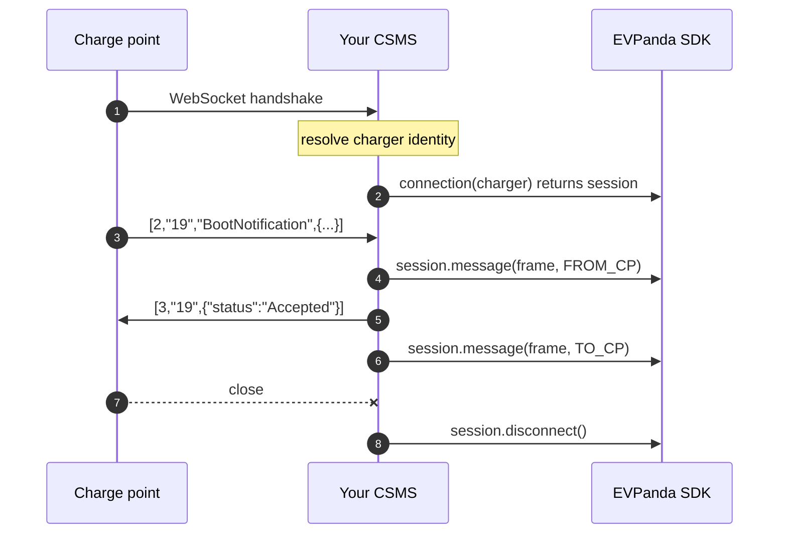

Three calls: one when a charge point connects, one per frame, one when the socket closes.

Shared setup (install, API key, config, shutdown, troubleshooting) is in [Getting started](/integration/getting-started).

## Model

EVPanda records a **connection**: everything on one WebSocket, from handshake to close, under one connection ID.



The session mints the connection ID and carries the identity, so per frame calls pass neither. A reconnect calls `connection()` again and gets a fresh ID.

`FROM_CP` is a frame the charge point sent you. `TO_CP` is one you sent it.

## Steps

<Steps>
  <Step title="Start the client">
    One client at boot, shared across the process. It needs a **charger network** API key.

    <CodeGroup>
    ```go Go
    panda, err := evpanda.StartOCPP(evpanda.OCPPConfig{})
    if err != nil {
        log.Printf("evpanda: %v (running inert)", err)
    }
    defer func() { _ = panda.Close() }()
    ```

    ```ts Node
    import { startOCPP } from "@evpanda/sdk";

    export const panda = startOCPP();
    if (panda.error) log.warn(`${panda.error.message} (running inert)`);
    ```

    ```python Python
    import evpanda

    panda = evpanda.start_ocpp()
    if panda.error:
        log.warning("%s (running inert)", panda.error)
    ```
    </CodeGroup>
  </Step>

  <Step title="Identify the charge point at the handshake">
    Your CSMS already does this before it decides whether to accept the connection. Use the same value.

    | Where identity lives | Typical CSMS |
    | --- | --- |
    | The WebSocket URL path, `wss://csms.example/ocpp/CP-001` | Most OCPP 1.6-J deployments |
    | HTTP Basic auth on the upgrade request | Security profile 1 and 2 |
    | The TLS client certificate common name | Security profile 3 |
    | A lookup in your own database | Multi-tenant platforms |

    <CodeGroup>
    ```go Go
    func resolveCharger(r *http.Request) (evpanda.Charger, bool) {
        id, ok := strings.CutPrefix(r.URL.Path, "/ocpp/")
        if !ok || id == "" {
            return evpanda.Charger{}, false
        }
        return evpanda.Charger{ID: id}, true
    }
    ```

    ```ts Node
    function resolveCharger(req: IncomingMessage): Charger | undefined {
      const id = req.url?.split("/").pop();
      return id ? { id } : undefined;
    }
    ```

    ```python Python
    def resolve_charger(websocket) -> evpanda.Charger | None:
        charger_id = websocket.request.path.rsplit("/", 1)[-1]
        return evpanda.Charger(id=charger_id) if charger_id else None
    ```
    </CodeGroup>
  </Step>

  <Step title="Open a session when the socket opens">
    `connection()` records the connect and returns the handle.

    <CodeGroup>
    ```go Go
    sess := panda.Connection(charger)
    defer sess.Disconnect()
    ```

    ```ts Node
    const session = panda.connection(charger);
    ```

    ```python Python
    # Also a context manager: leaving the block records the disconnect.
    with panda.connection(charger) as session:
        ...
    ```
    </CodeGroup>

    One session per socket. Sharing one across connections merges unrelated traffic; minting one per frame makes every frame its own session.
  </Step>

  <Step title="Capture inbound frames">
    Capture before you handle, so a frame that breaks your handler is still recorded.

    <CodeGroup>
    ```go Go
    for {
        _, frame, err := conn.ReadMessage()
        if err != nil {
            return
        }
        sess.Message(frame, evpanda.FromCP)

        reply := handleFrame(frame) // your CSMS logic
        cp.Send(reply)
    }
    ```

    ```ts Node
    socket.on("message", (raw) => {
      const frame = raw.toString();
      session.message(frame, "FROM_CP");

      const reply = handleFrame(frame); // your CSMS logic
      if (reply) send(reply);
    });
    ```

    ```python Python
    async for frame in websocket:
        session.message(frame, evpanda.OCPPDirection.FROM_CP)

        reply = handle_frame(frame)  # your CSMS logic
        if reply is not None:
            await send(reply)
    ```
    </CodeGroup>
  </Step>

  <Step title="Capture outbound frames">
    A CSMS writes from more than one place: replies from the read loop, and calls your operators or schedulers start. Put the write and the capture behind one helper so nothing reaches the socket uncaptured.

    <CodeGroup>
    ```go Go
    type chargePoint struct {
        conn *websocket.Conn
        sess *evpanda.OCPPSession
        mu   sync.Mutex // most WebSocket libraries allow one writer
    }

    func (cp *chargePoint) Send(frame []byte) error {
        cp.mu.Lock()
        defer cp.mu.Unlock()

        if err := cp.conn.WriteMessage(websocket.TextMessage, frame); err != nil {
            return err
        }
        cp.sess.Message(frame, evpanda.ToCP)
        return nil
    }
    ```

    ```ts Node
    const send = (frame: string): void => {
      socket.send(frame);
      session.message(frame, "TO_CP");
    };
    ```

    ```python Python
    async def send(frame: str) -> None:
        await websocket.send(frame)
        session.message(frame, evpanda.OCPPDirection.TO_CP)
    ```
    </CodeGroup>

    Capture after a successful write. A frame that failed to send never reached the charge point, and recording it as sent makes the validation engine look for a response that was never coming.
  </Step>

  <Step title="Close the session when the socket closes">
    Attach it where you clean up your own connection state, somewhere that runs on an abrupt drop and not only on a clean shutdown.

    <CodeGroup>
    ```go Go
    sess := panda.Connection(charger)
    defer sess.Disconnect() // runs on any return path
    ```

    ```ts Node
    socket.on("close", () => session.disconnect());
    ```

    ```python Python
    # The `with` block records it on exit. Without the block:
    session = panda.connection(charger)
    try:
        ...
    finally:
        session.disconnect()
    ```
    </CodeGroup>

    <Warning>
      A charge point that loses power never closes cleanly. If `disconnect()` only runs on your graceful path, sessions never end and flapping chargers look healthy.
    </Warning>
  </Step>
</Steps>

## Complete example

<Tabs>
  <Tab title="Go">
    Uses [gorilla/websocket](https://github.com/gorilla/websocket). Nothing here depends on it.

    ```go csms.go
    package main

    import (
        "log"
        "net/http"
        "strings"
        "sync"

        evpanda "github.com/evpanda-labs/evpanda-go"
        "github.com/gorilla/websocket"
    )

    var upgrader = websocket.Upgrader{Subprotocols: []string{"ocpp1.6"}}

    type CSMS struct{ panda *evpanda.OCPPClient }

    func (c *CSMS) HandleWebSocket(w http.ResponseWriter, r *http.Request) {
        charger, ok := resolveCharger(r)
        if !ok {
            http.Error(w, "unknown charge point", http.StatusUnauthorized)
            return
        }

        conn, err := upgrader.Upgrade(w, r, nil)
        if err != nil {
            return
        }
        defer conn.Close()

        sess := c.panda.Connection(charger)
        defer sess.Disconnect()

        cp := &chargePoint{conn: conn, sess: sess}

        for {
            _, frame, err := conn.ReadMessage()
            if err != nil {
                return
            }
            sess.Message(frame, evpanda.FromCP)

            reply, err := c.handleFrame(charger, frame)
            if err != nil {
                log.Printf("csms: %v", err)
                continue
            }
            if err := cp.Send(reply); err != nil {
                return
            }
        }
    }

    type chargePoint struct {
        conn *websocket.Conn
        sess *evpanda.OCPPSession
        mu   sync.Mutex
    }

    // Every outbound frame goes through here.
    func (cp *chargePoint) Send(frame []byte) error {
        cp.mu.Lock()
        defer cp.mu.Unlock()

        if err := cp.conn.WriteMessage(websocket.TextMessage, frame); err != nil {
            return err
        }
        cp.sess.Message(frame, evpanda.ToCP)
        return nil
    }

    func resolveCharger(r *http.Request) (evpanda.Charger, bool) {
        id, ok := strings.CutPrefix(r.URL.Path, "/ocpp/")
        if !ok || id == "" {
            return evpanda.Charger{}, false
        }
        return evpanda.Charger{ID: id}, true
    }
    ```
  </Tab>

  <Tab title="Node">
    Uses [`ws`](https://github.com/websockets/ws).

    ```ts csms.ts
    import { randomUUID } from "node:crypto";
    import { WebSocketServer } from "ws";
    import { startOCPP } from "@evpanda/sdk";

    import type { IncomingMessage } from "node:http";
    import type { Charger } from "@evpanda/sdk";

    const panda = startOCPP();
    if (panda.error) log.warn(`${panda.error.message} (running inert)`);

    const wss = new WebSocketServer({
      port: 8080,
      handleProtocols: () => "ocpp1.6",
    });

    const connections = new Map<string, (frame: string) => void>();

    wss.on("connection", (socket, req) => {
      const charger = resolveCharger(req);
      if (!charger) return socket.close(1008, "unknown charge point");

      const session = panda.connection(charger);

      // One send path, so no outbound frame escapes uncaptured.
      const send = (frame: string): void => {
        socket.send(frame);
        session.message(frame, "TO_CP");
      };
      connections.set(charger.id, send);

      socket.on("message", (raw) => {
        const frame = raw.toString();
        session.message(frame, "FROM_CP");

        const reply = handleFrame(charger, frame); // your CSMS logic
        if (reply) send(reply);
      });

      socket.on("close", () => {
        connections.delete(charger.id);
        session.disconnect();
      });
    });

    // Elsewhere: an operator triggers a remote start.
    export function remoteStart(chargerId: string, payload: unknown): void {
      connections.get(chargerId)?.(
        JSON.stringify([2, randomUUID(), "RemoteStartTransaction", payload]),
      );
    }

    function resolveCharger(req: IncomingMessage): Charger | undefined {
      const id = req.url?.split("/").pop();
      return id ? { id } : undefined;
    }
    ```
  </Tab>

  <Tab title="Python">
    Uses [`websockets`](https://websockets.readthedocs.io). The same calls fit the [`ocpp`](https://github.com/mobilityhouse/ocpp) library's `ChargePoint` class.

    ```python csms.py
    import asyncio

    import evpanda
    import websockets

    panda = evpanda.start_ocpp()
    if panda.error:
        log.warning("%s (running inert)", panda.error)


    async def handle_charger(websocket) -> None:
        charger = resolve_charger(websocket)
        if charger is None:
            await websocket.close(code=1008)
            return

        # Leaving the block records the disconnect, on clean closes and
        # abrupt drops alike.
        with panda.connection(charger) as session:

            async def send(frame: str) -> None:
                await websocket.send(frame)
                session.message(frame, evpanda.OCPPDirection.TO_CP)

            async for frame in websocket:
                session.message(frame, evpanda.OCPPDirection.FROM_CP)

                reply = handle_frame(charger, frame)  # your CSMS logic
                if reply is not None:
                    await send(reply)


    def resolve_charger(websocket) -> evpanda.Charger | None:
        charger_id = websocket.request.path.rsplit("/", 1)[-1]
        return evpanda.Charger(id=charger_id) if charger_id else None


    async def main() -> None:
        async with websockets.serve(
            handle_charger, "0.0.0.0", 8080, subprotocols=["ocpp1.6"]
        ):
            await asyncio.Future()


    asyncio.run(main())
    ```
  </Tab>
</Tabs>

## Per-SDK notes

<AccordionGroup>
  <Accordion title="Go: serialize your writes">
    The client and session are safe from multiple goroutines, but most WebSocket libraries allow only one concurrent writer. Keep the capture call inside the helper that holds the write lock, so capture and write cannot disagree about what was sent.
  </Accordion>

  <Accordion title="Node: frames may be a string or bytes">
    `message()` takes a `BodyInput`, so `raw.toString()` and the raw `Buffer` both work. A string is encoded as UTF-8.
  </Accordion>

  <Accordion title="Python: capture is safe from async code">
    Delivery runs on a background daemon thread, so the calls never block the event loop and never await. Frames may be `bytes` or `str`.
  </Accordion>
</AccordionGroup>

## Multi-tenant CSMS

Add the tenant pair at the handshake. Optional but all or nothing.

<CodeGroup>
```go Go
evpanda.Charger{ID: "CP-001", TenantID: "cpo-42", TenantName: "Acme Energy"}
```

```ts Node
const charger: Charger = {
  id: "CP-001",
  tenantId: "cpo-42",
  tenantName: "Acme Energy",
};
```

```python Python
evpanda.Charger(id="CP-001", tenant_id="cpo-42", tenant_name="Acme Energy")
```
</CodeGroup>

<Warning>
  Send a tenant pair on OCPP even with one operator. The ingestion API requires it on OCPP messages and rejects those that omit it after a successful delivery, so nothing in the SDK reports the loss. A constant value works.
</Warning>

## Flat primitives

`connection()` is built on three lower level calls. Use them when a session handle does not fit, such as replaying an archive.

<CodeGroup>
```go Go
connectionID := uuid.NewString() // stable per socket, fresh per reconnect

panda.CaptureConnect(evpanda.OCPPMessageInput{
    Identity: charger, ConnectionID: connectionID,
})

panda.CaptureMessage(evpanda.OCPPMessageInput{
    Identity:     charger,
    ConnectionID: connectionID,
    Data:         frame,
    Direction:    evpanda.FromCP,
})

panda.CaptureDisconnect(evpanda.OCPPMessageInput{
    Identity: charger, ConnectionID: connectionID,
})
```

```ts Node
import { randomUUID } from "node:crypto";

const connectionId = randomUUID(); // stable per socket, fresh per reconnect

panda.captureConnect({ identity: charger, connectionId });
panda.captureMessage({
  identity: charger,
  connectionId,
  data: frame,
  direction: "FROM_CP",
});
panda.captureDisconnect({ identity: charger, connectionId });
```

```python Python
import uuid

connection_id = str(uuid.uuid4())  # stable per socket, fresh per reconnect

panda.capture_connect(charger, connection_id)
panda.capture_message(
    charger, connection_id, frame, evpanda.OCPPDirection.FROM_CP
)
panda.capture_disconnect(charger, connection_id)
```
</CodeGroup>

The message call requires both the frame and the direction, and drops the message if either is missing. Connect and disconnect use neither.

<Warning>
  If you mint connection IDs yourself, the ID must be stable for the whole socket and fresh on every reconnect. Reusing the charger ID as the connection ID collapses a charger's entire history into one endless session.
</Warning>

## Common mistakes

| Mistake | Cost |
| --- | --- |
| Capturing only inbound frames | Every timeout, orphan, and duplicate ID finding, which are the most valuable OCPP checks |
| `disconnect()` only on the graceful path | Sessions that never end; flapping chargers look healthy |
| Capturing after your handler may fail | The one frame you most wanted to see |
| A client per connection | Thousands of workers, no batching |
| Omitting the tenant pair | Every message rejected server side, silently |

## Tune the network

Two settings shape what OCPP traffic becomes an issue. Both under the network's **Settings** tab.

| Setting | Default | Get it wrong and |
| --- | --- | --- |
| Call timeout | 30s | Too short, and slow but healthy chargers flood you with `call_response_timeout` |
| Idle timeout | 300s | Shorter than your heartbeat interval, and the whole fleet reads as flapping |

## Next

<Columns cols={2}>
  <Card title="Data flow" icon="scan-line" href="/concepts/capture-model">
    Event shapes and limits.
  </Card>

  <Card title="Getting started" icon="rocket" href="/integration/getting-started">
    Config, stats, shutdown, troubleshooting.
  </Card>
</Columns>
