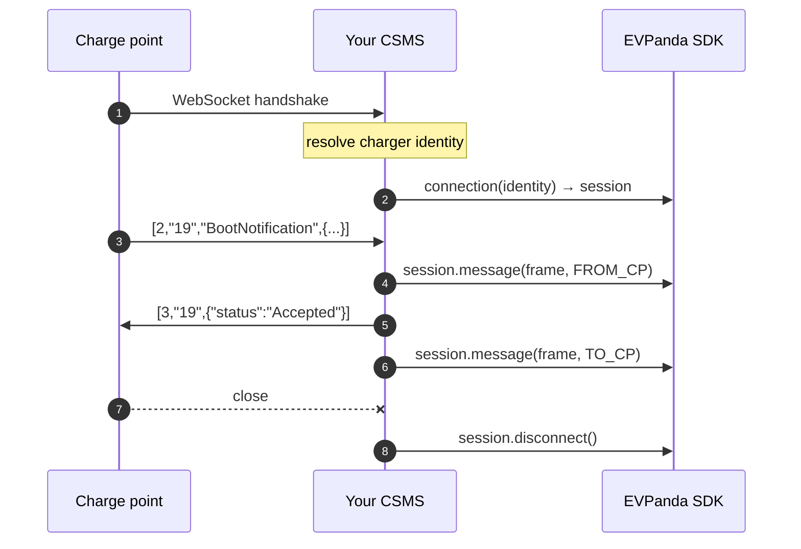

Instrumenting a CSMS means adding three calls to code you already have: one when a charge point connects, one per frame, one when the socket closes.

<Note>
  Everything shared across protocols — installing the SDK, getting an API key, configuration, monitoring, shutdown — is in [Getting started](/integration/getting-started). This page is the OCPP-specific part.
</Note>

## The model

EVPanda records an OCPP **connection**: everything that happened on one WebSocket, from handshake to close, under one connection ID.



The session handle owns the connection ID, so per-frame calls don't carry one. A reconnect calls `connection()` again and gets a fresh ID — which is how the dashboard tells one long session from twenty short ones.

### Direction is from the charge point's perspective

| Constant | The frame was… | Examples |
| --- | --- | --- |
| `FROM_CP` | sent by the charge point | `BootNotification`, `Heartbeat`, `StatusNotification`, and the results it returns to your calls |
| `TO_CP` | sent by your CSMS | `RemoteStartTransaction`, `Reset`, and the results you return to its calls |

Record it where the actual socket read or write happens. A helper that both sides call is where directions get flipped, and flipped directions make every request look like a response.

## Integration steps

<Steps>
  <Step title="Start one client at boot">
    Share it across your process — it is safe for concurrent use. Each client runs its own worker and buffer, so one per socket means thousands of workers and no batching.

    <CodeGroup>
      ```go Go
      // APIKey omitted → read from EVPANDA_API_KEY.
      panda, err := evpanda.StartOCPP(evpanda.OCPPConfig{
          BaseConfig: evpanda.BaseConfig{Endpoint: "https://ingest.evpanda.io"},
      })
      if err != nil {
          log.Printf("evpanda: %v (running inert)", err)
      }
      defer func() { _ = panda.Close() }()
      ```

      ```ts Node
      import { OCPPClient } from "@evpanda/sdk";

      export const panda = OCPPClient.start({
        endpoint: "https://ingest.evpanda.io",
        debug: process.env.NODE_ENV !== "production",
      });
      ```

      ```python Python
      from evpanda import OCPPClient, OCPPConfig

      panda = OCPPClient.start(
          OCPPConfig(endpoint="https://ingest.evpanda.io", debug=True)
      )
      ```
    </CodeGroup>

    The client needs a **charger network** API key. A roaming network's key is rejected.
  </Step>

  <Step title="Identify the charge point at the handshake">
    The SDK doesn't identify chargers for you — your CSMS already does, before it decides whether to accept the connection. Whatever you use for that is what you pass to EVPanda.

    | Where the identity lives | Typical CSMS |
    | --- | --- |
    | The WebSocket URL path — `wss://csms.example/ocpp/CP-001` | Most OCPP 1.6-J deployments |
    | HTTP Basic auth on the upgrade request | Security profile 1 and 2 |
    | The TLS client certificate's common name | Security profile 3 |
    | A lookup in your own database, keyed by any of the above | Multi-tenant platforms |

    <CodeGroup>
      ```go Go
      // Reads the identity from the URL path. Use whatever your CSMS
      // already relies on.
      func resolveCharger(r *http.Request) (evpanda.ChargerIdentity, bool) {
          id, ok := strings.CutPrefix(r.URL.Path, "/ocpp/")
          if !ok || id == "" {
              return evpanda.ChargerIdentity{}, false
          }
          return evpanda.ChargerIdentity{ChargerID: id}, true
      }
      ```

      ```ts Node
      function resolveCharger(req: IncomingMessage): ChargerIdentity | undefined {
        const chargerId = req.url?.split("/").pop();
        return chargerId ? { chargerId } : undefined;
      }
      ```

      ```python Python
      def resolve_charger(socket) -> ChargerIdentity | None:
          charger_id = socket.request.path.rsplit("/", 1)[-1]
          return ChargerIdentity(charger_id=charger_id) if charger_id else None
      ```
    </CodeGroup>

    If you're multi-tenant, add the tenant pair here — it is the one place you know it for certain. See [Identity](/concepts/identity).
  </Step>

  <Step title="Open a session when the socket opens">
    `connection()` records the connect, mints the connection ID, and returns a handle that carries both.

    <CodeGroup>
      ```go Go
      sess := panda.Connection(identity)
      defer sess.Disconnect()
      ```

      ```ts Node
      const session = panda.connection(identity);
      ```

      ```python Python
      # As a context manager — leaving the block records the disconnect.
      with panda.connection(identity) as session:
          ...
      ```
    </CodeGroup>

    Use **one session per socket**. Sharing one across connections merges unrelated traffic under one ID; minting a new one per frame makes every frame its own session.
  </Step>

  <Step title="Capture every inbound frame">
    Capture before you handle, so a frame that breaks your handler is still recorded — that is exactly the frame you want to see in EVPanda.

    <CodeGroup>
      ```go Go
      for {
          _, frame, err := conn.ReadMessage()
          if err != nil {
              return // socket closed — the deferred Disconnect records it
          }
          sess.Message(frame, evpanda.FromCP)

          reply, err := c.handleFrame(identity, frame) // your CSMS logic
          ...
      }
      ```

      ```ts Node
      socket.on("message", (raw) => {
        const frame = raw.toString();
        session.message(frame, "FROM_CP");

        const reply = handleFrame(identity, frame); // your CSMS logic
        if (reply) send(reply);
      });
      ```

      ```python Python
      async for frame in socket:
          session.message(frame, OCPPDirection.FROM_CP)

          reply = handle_frame(identity, frame)  # your CSMS logic
          if reply is not None:
              await send(reply)
      ```
    </CodeGroup>
  </Step>

  <Step title="Capture every outbound frame">
    A CSMS writes from more than one place — replies from the read loop, and calls your operators or schedulers initiate. Put the write and the capture behind one helper so nothing can reach the socket uncaptured.

    <CodeGroup>
      ```go Go
      type chargePoint struct {
          conn *websocket.Conn
          sess *evpanda.OCPPSession
          mu   sync.Mutex // most WebSocket libraries allow one writer
      }

      func (cp *chargePoint) Send(frame []byte) error {
          cp.mu.Lock()
          defer cp.mu.Unlock()

          if err := cp.conn.WriteMessage(websocket.TextMessage, frame); err != nil {
              return err
          }
          cp.sess.Message(frame, evpanda.ToCP)
          return nil
      }
      ```

      ```ts Node
      const send = (frame: string): void => {
        socket.send(frame);
        session.message(frame, "TO_CP");
      };
      ```

      ```python Python
      async def send(frame: str) -> None:
          await socket.send(frame)
          session.message(frame, OCPPDirection.TO_CP)
      ```
    </CodeGroup>

    <Tip>
      Capture **after** a successful write. A frame that failed to send never reached the charge point, and recording it as sent makes the validation engine hunt for a response that was never going to come.
    </Tip>
  </Step>

  <Step title="Close the session when the socket closes">
    Attach this where you clean up your own connection state — somewhere that runs on an abrupt drop, not just a clean shutdown.

    <CodeGroup>
      ```go Go
      sess := panda.Connection(identity)
      defer sess.Disconnect() // runs on any return path
      ```

      ```ts Node
      socket.on("close", () => session.disconnect());
      ```

      ```python Python
      # The `with` block above records it on exit. Without the block:
      session = panda.connection(identity)
      try:
          ...
      finally:
          session.disconnect()
      ```
    </CodeGroup>

    <Warning>
      A charge point that loses power never closes cleanly. If `disconnect()` only runs on your graceful path, the dashboard shows sessions that never end, and flapping chargers look healthy.
    </Warning>
  </Step>
</Steps>

## A complete example

<Tabs>
  <Tab title="Go">
    Uses [gorilla/websocket](https://github.com/gorilla/websocket), but nothing here is specific to it — swap in `nhooyr.io/websocket` and the capture calls stay where they are.

    ```go csms.go
    package main

    import (
        "log"
        "net/http"
        "strings"
        "sync"

        evpanda "github.com/evpanda-labs/evpanda-go"
        "github.com/gorilla/websocket"
    )

    var upgrader = websocket.Upgrader{Subprotocols: []string{"ocpp1.6"}}

    type CSMS struct{ panda *evpanda.OCPPClient }

    func (c *CSMS) HandleWebSocket(w http.ResponseWriter, r *http.Request) {
        identity, ok := resolveCharger(r)
        if !ok {
            http.Error(w, "unknown charge point", http.StatusUnauthorized)
            return
        }

        conn, err := upgrader.Upgrade(w, r, nil)
        if err != nil {
            return
        }
        defer conn.Close()

        sess := c.panda.Connection(identity)
        defer sess.Disconnect()

        cp := &chargePoint{conn: conn, sess: sess}

        for {
            _, frame, err := conn.ReadMessage()
            if err != nil {
                return
            }
            sess.Message(frame, evpanda.FromCP)

            reply, err := c.handleFrame(identity, frame)
            if err != nil {
                log.Printf("csms: %v", err)
                continue
            }
            if err := cp.Send(reply); err != nil {
                return
            }
        }
    }

    type chargePoint struct {
        conn *websocket.Conn
        sess *evpanda.OCPPSession
        mu   sync.Mutex
    }

    // Every outbound frame goes through here — read-loop replies and
    // CSMS-initiated calls alike.
    func (cp *chargePoint) Send(frame []byte) error {
        cp.mu.Lock()
        defer cp.mu.Unlock()

        if err := cp.conn.WriteMessage(websocket.TextMessage, frame); err != nil {
            return err
        }
        cp.sess.Message(frame, evpanda.ToCP)
        return nil
    }

    func resolveCharger(r *http.Request) (evpanda.ChargerIdentity, bool) {
        id, ok := strings.CutPrefix(r.URL.Path, "/ocpp/")
        if !ok || id == "" {
            return evpanda.ChargerIdentity{}, false
        }
        return evpanda.ChargerIdentity{ChargerID: id}, true
    }
    ```
  </Tab>

  <Tab title="Node">
    Uses [`ws`](https://github.com/websockets/ws).

    ```ts csms.ts
    import { WebSocketServer } from "ws";
    import { panda } from "./evpanda.js";

    import type { IncomingMessage } from "node:http";
    import type { ChargerIdentity } from "@evpanda/sdk";

    const wss = new WebSocketServer({
      port: 8080,
      handleProtocols: () => "ocpp1.6",
    });

    const connections = new Map<string, (frame: string) => void>();

    wss.on("connection", (socket, req) => {
      const identity = resolveCharger(req);
      if (!identity) {
        socket.close(1008, "unknown charge point"); // your policy, not the SDK's
        return;
      }

      const session = panda.connection(identity);

      // One send path, so no outbound frame escapes uncaptured.
      const send = (frame: string): void => {
        socket.send(frame);
        session.message(frame, "TO_CP");
      };
      connections.set(identity.chargerId, send);

      socket.on("message", (raw) => {
        const frame = raw.toString();
        session.message(frame, "FROM_CP");

        const reply = handleFrame(identity, frame); // your CSMS logic
        if (reply) send(reply);
      });

      socket.on("close", () => {
        connections.delete(identity.chargerId);
        session.disconnect();
      });
    });

    // Elsewhere in your CSMS — an operator triggers a remote start.
    export function remoteStart(chargerId: string, payload: unknown): void {
      connections.get(chargerId)?.(
        JSON.stringify([2, randomUUID(), "RemoteStartTransaction", payload]),
      );
    }

    function resolveCharger(req: IncomingMessage): ChargerIdentity | undefined {
      const chargerId = req.url?.split("/").pop();
      return chargerId ? { chargerId } : undefined;
    }
    ```
  </Tab>

  <Tab title="Python">
    Uses [`websockets`](https://websockets.readthedocs.io). The same calls fit the [`ocpp`](https://github.com/mobilityhouse/ocpp) library's `ChargePoint` class.

    ```python csms.py
    import asyncio

    import websockets
    from evpanda import ChargerIdentity, OCPPDirection

    from evpanda_client import panda


    async def handle_charger(socket) -> None:
        identity = resolve_charger(socket)
        if identity is None:
            await socket.close(1008, "unknown charge point")
            return

        # Leaving the block records the disconnect, on clean closes and
        # abrupt drops alike.
        with panda.connection(identity) as session:

            async def send(frame: str) -> None:
                await socket.send(frame)
                session.message(frame, OCPPDirection.TO_CP)

            async for frame in socket:
                session.message(frame, OCPPDirection.FROM_CP)

                reply = handle_frame(identity, frame)  # your CSMS logic
                if reply is not None:
                    await send(reply)


    def resolve_charger(socket) -> ChargerIdentity | None:
        charger_id = socket.request.path.rsplit("/", 1)[-1]
        return ChargerIdentity(charger_id=charger_id) if charger_id else None


    async def main() -> None:
        async with websockets.serve(
            handle_charger, "0.0.0.0", 8080, subprotocols=["ocpp1.6"]
        ):
            await asyncio.Future()  # run forever


    asyncio.run(main())
    ```
  </Tab>
</Tabs>

## Per-SDK notes

<AccordionGroup>
  <Accordion title="Go — serialize your writes" icon="code">
    The client and session are safe to use from multiple goroutines, but most WebSocket libraries allow only one concurrent writer. Keep the capture call inside the same helper that holds the write lock, so capture and write can never disagree about what was sent.
  </Accordion>

  <Accordion title="Node — the session handle needs 0.1.0" icon="code">
    On earlier published versions `connection()` does not exist. Use the flat primitives below; everything else on this page is unchanged.
  </Accordion>

  <Accordion title="Python — frames may be str or bytes" icon="code">
    `message()` accepts either, and encodes a `str` as UTF-8, so you can pass whatever your WebSocket library hands you.

    ```python
    session.message('[2,"19","BootNotification",{}]', OCPPDirection.FROM_CP)
    session.message(b'[3,"19",{"status":"Accepted"}]', OCPPDirection.TO_CP)
    ```

    Capture is safe from async code: delivery runs on a background daemon thread, so the calls never block the event loop and never await.
  </Accordion>

  <Accordion title="OCPP frames are captured verbatim" icon="shield">
    There is no OCPP redaction — an altered frame is not evidence of what your charger did. If a payload carries data you don't want stored, an `idTag` for example, mask it before you hand the frame to the SDK.

    ```go
    sess.Message(maskIDTag(frame), evpanda.FromCP)
    ```
  </Accordion>
</AccordionGroup>

## Multi-tenant CSMS

Add the tenant pair to the identity at the handshake. It is optional but all-or-nothing — set both fields or neither.

<CodeGroup>
  ```go Go
  evpanda.ChargerIdentity{
      ChargerID:  "CP-001",
      TenantID:   "cpo-42",
      TenantName: "Acme Energy",
  }
  ```

  ```ts Node
  {
    chargerId: "CP-001",
    tenantId: "cpo-42",
    tenantName: "Acme Energy",
  }
  ```

  ```python Python
  ChargerIdentity(
      charger_id="CP-001",
      tenant_id="cpo-42",
      tenant_name="Acme Energy",
  )
  ```
</CodeGroup>

<Warning>
  Send a tenant pair on OCPP **even if you have one operator**. The ingestion API currently requires it on OCPP messages, and rejects those that omit it after a successful delivery — so nothing in the SDK reports the loss. A constant value such as your own operator name is fine. See [Identity](/concepts/identity#tenants).
</Warning>

## The flat primitives

`connection()` is built on three lower-level calls. Use them when a session handle doesn't fit — replaying an archive, capturing from a component that only sees frames, or on a Node version without the handle.

<CodeGroup>
  ```go Go
  connectionID := uuid.NewString() // stable per socket, fresh per reconnect

  panda.CaptureConnect(evpanda.OCPPMessageInput{
      Identity: identity, ConnectionID: connectionID,
  })

  panda.CaptureMessage(evpanda.OCPPMessageInput{
      Identity:     identity,
      ConnectionID: connectionID,
      Data:         frame,
      Direction:    evpanda.FromCP,
  })

  panda.CaptureDisconnect(evpanda.OCPPMessageInput{
      Identity: identity, ConnectionID: connectionID,
  })
  ```

  ```ts Node
  import { randomUUID } from "node:crypto";

  const connectionId = randomUUID(); // stable per socket, fresh per reconnect

  panda.captureConnect({ identity, connectionId });

  panda.captureMessage({
    identity,
    connectionId,
    data: frame,          // string or Uint8Array
    direction: "FROM_CP",
  });

  panda.captureDisconnect({ identity, connectionId });
  ```

  ```python Python
  import uuid

  from evpanda import OCPPMessageInput

  connection_id = str(uuid.uuid4())  # stable per socket, fresh per reconnect

  panda.capture_connect(
      OCPPMessageInput(identity=identity, connection_id=connection_id)
  )

  panda.capture_message(
      OCPPMessageInput(
          identity=identity,
          connection_id=connection_id,
          data=frame,
          direction=OCPPDirection.FROM_CP,
      )
  )

  panda.capture_disconnect(
      OCPPMessageInput(identity=identity, connection_id=connection_id)
  )
  ```
</CodeGroup>

The message call requires both the frame and the direction, and drops the message if either is missing. Connect and disconnect ignore both.

<Warning>
  If you mint connection IDs yourself, the ID must be stable for the whole socket and **fresh on every reconnect**. Reusing the charger ID as the connection ID collapses a charger's entire history into one endless session.
</Warning>

## Common mistakes

| Mistake | What it costs you |
| --- | --- |
| Capturing only inbound frames | Every timeout, orphan, and duplicate-ID finding — the most valuable OCPP checks EVPanda runs |
| `disconnect()` only on the graceful path | Sessions that never end; flapping chargers look healthy |
| Capturing after your handler may panic | The one frame you most wanted to see |
| Building a client per connection | Thousands of workers, no batching |
| Omitting the tenant pair | Every message rejected server-side, silently |

## Tune the network

Two per-network settings shape what OCPP traffic gets reported as an issue. Both are under the network's **Settings** tab.

| Setting | Default | Get it wrong and… |
| --- | --- | --- |
| **Call timeout** | 30s | Too short, and normal-but-slow chargers flood you with `call_response_timeout` |
| **Idle timeout** | 300s | Shorter than your heartbeat interval, and your whole fleet reads as flapping |

## Next

<Columns cols={2}>
  <Card title="What gets captured" icon="scan-line" href="/concepts/capture-model">
    Event shapes, size limits, and what the SDK deliberately leaves out.
  </Card>

  <Card title="Getting started" icon="rocket" href="/integration/getting-started">
    Configuration, monitoring, shutdown, and troubleshooting.
  </Card>
</Columns>
