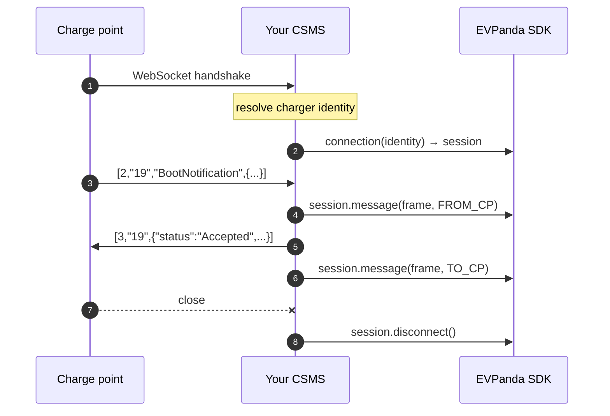

Instrumenting a CSMS means adding three calls to code you already have: one when a charge point connects, one per frame, one when the socket closes. Everything else is configuration.

<Columns cols={3}>
  <Card title="Go" icon="code" href="/ocpp/go">
    net/http, gorilla/websocket
  </Card>

  <Card title="Node" icon="code" href="/ocpp/node">
    ws, µWebSockets
  </Card>

  <Card title="Python" icon="code" href="/ocpp/python">
    websockets, ocpp
  </Card>
</Columns>

## The model

EVPanda records an OCPP **connection**: everything that happened on one WebSocket, from handshake to close, under one connection ID.



The session handle owns the connection ID, so per-frame calls don't carry one. A reconnect calls `connection()` again and gets a fresh ID, which is how the dashboard can tell one long session from twenty short ones.

<Note>
  Use one session per socket. Sharing a session across connections merges unrelated traffic under one ID; minting a new one per frame makes every frame its own session.
</Note>

## Resolving charge point identity

The SDK does not identify chargers for you — your CSMS already does, at handshake time, and that decision is yours. Whatever you use to accept or reject a connection is what you should pass to EVPanda.

| Where the identity lives | Typical CSMS |
| --- | --- |
| The WebSocket URL path — `wss://csms.example/ocpp/CP-001` | Most OCPP 1.6-J deployments |
| HTTP Basic auth on the upgrade request | Security profile 1 and 2 |
| The TLS client certificate's common name | Security profile 3 |
| A lookup in your own database, keyed by any of the above | Multi-tenant platforms |

Resolve it **before** the upgrade, alongside the check you already run to decide whether the charge point is allowed to connect:

<CodeGroup>
  ```go Go
  identity, ok := resolveCharger(r) // your existing lookup
  if !ok {
      http.Error(w, "unknown charge point", http.StatusUnauthorized)
      return
  }

  conn := upgrade(w, r)
  sess := panda.Connection(identity)
  defer sess.Disconnect()
  ```

  ```ts Node
  const identity = resolveCharger(req); // your existing lookup
  if (!identity) {
    socket.close(1008, "unknown charge point");
    return;
  }

  const session = panda.connection(identity);
  ```

  ```python Python
  identity = resolve_charger(request)  # your existing lookup
  if identity is None:
      await socket.close(1008, "unknown charge point")
      return

  session = panda.connection(identity)
  ```
</CodeGroup>

If you are multi-tenant, add the tenant pair here too — it is the one place you know it for certain. See [Identity](/concepts/identity#tenants).

## Direction

Direction is from the **charge point's** perspective, and it is what makes a request readable as a request.

| Constant | The frame was… | Examples |
| --- | --- | --- |
| `FROM_CP` | sent by the charge point | `BootNotification`, `Heartbeat`, `StatusNotification`, and the results it returns to your calls |
| `TO_CP` | sent by your CSMS | `RemoteStartTransaction`, `Reset`, and the results you return to its calls |

Record it where the actual socket read or write happens. A helper that both sides call is where directions get flipped.

## Where the calls go

<Steps>
  <Step title="At the handshake, after you accept the charge point">
    Call `connection(identity)`. It records the connect and returns the session.
  </Step>

  <Step title="On every inbound frame, before you handle it">
    Call `session.message(frame, FROM_CP)` in your read loop. Capture first, then process, so a frame that crashes your handler is still recorded.
  </Step>

  <Step title="On every outbound frame, right after you write it">
    Call `session.message(frame, TO_CP)`. Wrap your send path in a helper so no write can escape without being captured — CSMS-initiated calls usually originate somewhere far from the read loop.
  </Step>

  <Step title="When the socket closes, for any reason">
    Call `session.disconnect()` from the same place you clean up your own connection state. A `defer`, a `finally`, or a `close` handler — anywhere it will run on an abrupt drop, not just a clean shutdown.
  </Step>
</Steps>

## Concurrency

The client and the session are safe to use from multiple goroutines, threads, or callbacks. Capture calls take no locks that your code can contend on, do no I/O, and return immediately.

That is not true of most WebSocket libraries: a raw socket generally does not allow concurrent writes. If your CSMS sends from more than one place, serialize the writes yourself — and put the capture call inside the same helper that owns that lock, so capture and write can't disagree about what was sent.

## Common mistakes

<AccordionGroup>
  <Accordion title="Capturing only inbound frames" icon="arrow-down">
    Half the traffic makes half the picture. Without `TO_CP` frames, the validation engine cannot pair calls with results, so you lose every timeout, orphan, and duplicate-ID finding — the most valuable OCPP checks EVPanda runs.
  </Accordion>

  <Accordion title="Minting your own connection IDs" icon="hash">
    The session mints one for you. If you use the flat primitives instead, the ID must be stable for the whole socket and fresh on every reconnect — reusing a charger ID as the connection ID collapses a charger's entire history into one session.
  </Accordion>

  <Accordion title="Forgetting disconnect on abrupt drops" icon="unplug">
    A charge point that loses power never closes cleanly. If `disconnect()` only runs on your graceful path, the dashboard will show sessions that never end, and flapping chargers will look healthy.
  </Accordion>

  <Accordion title="Capturing after your handler may panic" icon="triangle-alert">
    Capture the inbound frame before you process it. A frame that breaks your handler is exactly the frame you want to see in EVPanda.
  </Accordion>

  <Accordion title="Building the client per connection" icon="repeat">
    Start one client at boot and share it. Each client starts its own worker and its own buffer; one per socket means thousands of workers and no batching.
  </Accordion>
</AccordionGroup>

## Next

<Columns cols={3}>
  <Card title="Go" icon="code" href="/ocpp/go">
    Full CSMS example with gorilla/websocket.
  </Card>

  <Card title="Node" icon="code" href="/ocpp/node">
    Full CSMS example with `ws`.
  </Card>

  <Card title="Python" icon="code" href="/ocpp/python">
    Full CSMS example with `websockets`.
  </Card>
</Columns>
