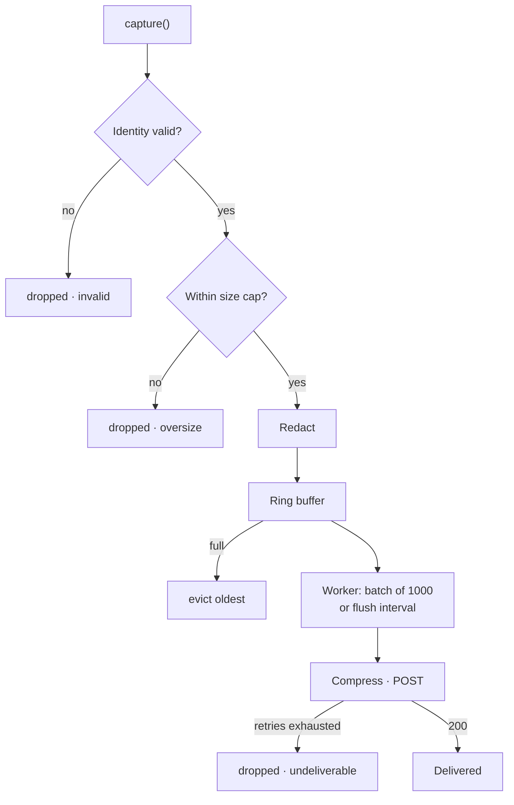

The SDK trades completeness for safety. It will drop its own data before it slows your service down, and everywhere it does that is counted, so the trade is auditable rather than mysterious.



## The capture chokepoint

Everything a capture call does happens on your thread, and none of it is I/O:

<Steps>
  <Step title="Validate identity">
    A message that can't be attributed is dropped. See [Identity](/concepts/identity).
  </Step>

  <Step title="Enforce the size cap">
    A body or frame over `maxCaptureBytes` drops the whole message. Truncating would produce a record that validates as broken protocol traffic when the traffic was fine.
  </Step>

  <Step title="Redact">
    OCPI headers are filtered to the allowlist and `/credentials` tokens are masked. This is the last point before the data outlives the call.
  </Step>

  <Step title="Copy and buffer">
    Bodies are copied so the SDK owns what it holds, then the message enters the ring buffer and the call returns.
  </Step>
</Steps>

Capture never blocks, never does network I/O, and never raises into your code. A panic inside the SDK is recovered, counted, and swallowed.

## The ring buffer

Buffered messages wait in memory for the next flush. The buffer has a hard ceiling, and when it is reached the SDK evicts its **oldest** entries to make room for new ones.

Oldest-first is deliberate. When delivery has been stalled, the freshest messages describe the incident you are currently having; the ones from four minutes ago describe a system that has already moved on.

| SDK | Ceiling | Default |
| --- | --- | --- |
| Go | Bytes | 32 MiB |
| Node | Messages | 10,000 |
| Python | Messages | 10,000 |

The buffer grows on demand and sits far below its ceiling whenever delivery is healthy. A rising `BufferedMessages` gauge is the earliest signal that delivery is falling behind — long before anything is dropped.

<Note>
  The SDK never applies backpressure to your application. There is no mode in which a full buffer slows a capture call down: it evicts and moves on.
</Note>

## Batching and flushing

One background worker per client owns delivery. It flushes when either trigger fires:

- **1,000 messages are waiting** — the ingestion API's per-request maximum.
- **The flush interval elapses** — five seconds by default.

On a busy CSMS the batch trigger fires first almost every time. On a quiet OCPI server the interval does.

Each flush drains the buffer, chunks it into batches of 1,000, serializes to JSON, and compresses with zstd (or gzip). Payloads under about 1 KB are sent uncompressed.

## Retries

Each batch gets up to **five attempts** with fully jittered exponential backoff, starting at 500 ms and capped at 30 seconds. Each individual request has a 30-second timeout, so a hung connection feeds the backoff instead of stalling the worker.

| Response | Treated as | What happens |
| --- | --- | --- |
| `200` | Success | Batch is done. The response reports how many messages were `captured` and how many `failed` validation server-side |
| `400` | Permanent | Dropped immediately — a malformed batch will never succeed |
| `401` | Permanent | Dropped immediately — a bad API key won't fix itself on retry |
| `413` | Permanent | Dropped immediately — the batch is over the size limit |
| `5xx` | Retryable | Backoff and retry |
| Network error or timeout | Retryable | Backoff and retry |

Retries are not configurable. The policy is deliberately fixed: an SDK on a customer's production hot path that retries aggressively against a struggling ingestion API turns a partial outage into a full one.

<Warning>
  `400`, `401`, and `413` are the only permanent rejections, and they are silent by default — the batch is dropped and counted, not raised. After rotating an API key, check that traffic is still arriving.
</Warning>

## Where data can be lost

Five places, all counted:

| Counter | Cause | What to do |
| --- | --- | --- |
| `DroppedInvalid` | Identity failed validation | Fix identity resolution — usually an adapter mounted before auth |
| `DroppedOversize` | Body or frame over the cap | Raise `maxCaptureBytes`, or accept it for outliers |
| `DroppedEvicted` | Buffer full, oldest evicted | Upstream can't keep up, or the buffer is undersized for your traffic |
| `DroppedUndeliverable` | Retries exhausted or permanent rejection | Network, API key, or ingestion fault |
| `DroppedPanic` | A recovered panic inside the SDK | A bug — please report it |

Go exposes all five through `Stats()`. Node and Python report them through the debug log. See [Monitoring](/operate/monitoring).

## Forcing a flush

`flush()` delivers everything currently buffered and waits for that delivery to settle. It blocks for as long as the transport's retries take.

<CodeGroup>
  ```go Go
  if err := panda.Flush(); err != nil {
      log.Printf("evpanda: %v", err)
  }
  ```

  ```ts Node
  await panda.flush();
  ```

  ```python Python
  panda.flush()
  ```
</CodeGroup>

Use it in tests, at shutdown, or while debugging an integration — never on a request path. Capture is already asynchronous; forcing a flush per message defeats every batching benefit and puts network latency back on your thread.

## Draining at shutdown

`close()` stops capture and drains what is buffered, within a deadline.

| Call | Deadline | Use when |
| --- | --- | --- |
| `Close()` / `close()` | The configured drain timeout, 10s by default | You have no shutdown context of your own |
| `Shutdown(ctx)` *(Go)* | Your context's deadline | Your service already has a shutdown context |
| `close(ms)` / `close(seconds)` *(Node, Python)* | The value you pass | You want a different deadline for this call |

Order matters: **stop accepting traffic first, then drain**. Draining while chargers are still sending is a race you'll lose.

<CodeGroup>
  ```go Go
  srv.Shutdown(ctx)                  // stop accepting…
  if err := panda.Shutdown(ctx); err != nil {
      log.Printf("evpanda: %v", err) // …then drain
  }
  ```

  ```ts Node
  server.close();
  await panda.close();
  ```

  ```python Python
  server.shutdown()
  panda.close()
  ```
</CodeGroup>

Close is idempotent, and captures made after it are safe no-ops — a late frame from a socket you're still tearing down won't crash anything. In Go, `Close` and `Shutdown` return `ErrDrainIncomplete` if the deadline passed with messages still buffered.

<Warning>
  In Node, `close()` returns a promise. Not awaiting it is the difference between draining the buffer and discarding it.
</Warning>

## What the ingestion API does with a batch

It authenticates the key, validates each message independently, writes the valid ones to durable storage, and returns:

```json
{ "captured": 998, "failed": 2 }
```

`failed` messages were rejected by server-side validation — a field over its length limit, a `MESSAGE` event with no frame, a malformed timestamp. A batch where every message fails still returns `200`, because a permanently bad batch must not trigger a retry storm.

There is no per-message error detail in the response. If `failed` is consistently non-zero, check identity field lengths first — see the [Ingestion API reference](/reference/ingestion-api).
